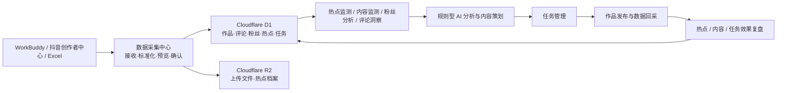

# 独山子大峡谷 AI 新媒体运营中心

独山子大峡谷 AI 新媒体运营中心是景区 AI 营销中台的新媒体子系统，用于统一接收热点、作品、评论和粉丝数据，并完成监测分析、内容策划、生产任务、发布关联和效果复盘。

当前仓库是独立的新媒体运营中心仓库，不包含 OTA 销售驾驶舱代码。正式业务闭环优先支持抖音；快手、微博已有平台筛选和统一数据协议，但真实内容与粉丝数据仍需持续接入。视频号不在当前系统范围。

## 当前版本

- 建议阶段版本：**`social-v0.9.0` 候选基线**
- `package.json`：`0.1.0`
- 正式 Git tag：尚未创建
- V1.0 目标：抖音“采集 → 监测 → 策划 → 任务 → 发布 → 复盘”稳定闭环

版本路线见 [docs/version-roadmap.md](docs/version-roadmap.md)。

## 主要模块

| 模块 | 路径 | 当前能力 | 状态 |
|---|---|---|---|
| 运营驾驶舱 | `/` | 周期 KPI、发布、播放互动、作品排行、热点和运营建议 | 已完成 |
| 内容监测中心 | `/insights/content` | 分平台作品监测、TOP10、爆款分析、低效诊断、热点关联 | 待优化 |
| 粉丝分析中心 | `/insights/fans` | 抖音真实总量、跨批次增长/画像/热词比较、期间作品关联、内容吸粉、周报和导出 | 待优化 |
| 数据采集中心 | `/collector`、`/imports` | 抖音 V3 预览确认、统一 V2 API、WorkBuddy热点自动接力、Excel/图片导入和采集日志 | 开发中 |
| 热点监测中心 | `/hot-topics` | WorkBuddy 热点、关联分析、A/B/C 推荐、选题和效果复盘 | 已完成 |
| 热点档案库 | `/hot-topic-archive` | 历史查询、每日快照和 Excel 下载 | 已完成 |
| AI 内容分析中心 | `/ai-analysis` | 规则型作品评分、平台建议、日报/周报 | 待优化 |
| AI 内容策划中心 | `/content-planning` | 抖音 A 级热点生成方案、任务、作品关联和 7 日复盘 | 待优化 |
| 游客评论洞察中心 | `/comment-insights` | 情绪、关键词、游客需求和运营建议 | 待优化 |
| 任务管理中心 | `/tasks` | 八阶段 Kanban 拖拽、来源记录、作品关联和周报 | 已完成 |
| 营销运营中心 | `/marketing-operations` | 今日待办、运营日历、月度目标和每日简报 | 已完成 |

完整状态和问题见 [docs/module-status.md](docs/module-status.md)。

## 系统架构简图



技术栈：Next.js 16、React 19、TypeScript、Vinext/Vite、Cloudflare Worker/Sites、D1、R2、Drizzle ORM。

## 数据来源现状

| 来源 | 当前状态 | 说明 |
|---|---|---|
| WorkBuddy 热点监测 Agent | 已接入自动接力 | 本机检测当天 JSON/Excel，严格校验后自动暂存、入库、AI分析、归档并刷新当日A级选题 |
| 抖音创作者中心粉丝数据 | 已完成首次真实闭环 | Codex只读采集生成原始 JSON，经预览确认后写入粉丝批次、账号快照、增长记录和画像明细；V2.1 将在第二批真实数据进入后自动与上一批比较，缺失项保持 unavailable |
| WorkBuddy 抖音作品 | 已完成首次真实闭环 | WorkBuddy 负责采集，系统对真实 JSON 预览确认后写入作品主表、历史快照、流量、观众、热词和评论；DOU+ 与自然流量分离 |
| Excel / 图片 | 已实现 | Excel 可导入作品；图片保存记录并人工确认，复杂 OCR 未实现 |
| MediaCrawler | 未接入 | 仅完成评估和接口规划，未安装依赖、未运行采集任务 |
| Agent-Reach | 未接入 | 仅完成全网趋势/新闻补充的技术评估 |

当前“AI”分析主要是可复核的规则模型，不是已上线的大模型自动运营。所有正式数据必须来自数据库或明确的数据接收流程，不使用永久模拟数据填充业务结果。

### WorkBuddy 热点自动接力 V1.0

本机接力器只读取 WorkBuddy 固定输出目录，不改变其调度。新文件通过既有统一采集 API 暂存并执行整批预检，按“文件日期 + 平台 + 榜单类型 + 热点名称 + 排名”去重；通过后自动写入 `hot_topics`、以规则模型生成 `hot_topic_analysis`、输出 R2 Excel 档案，并刷新当天抖音 A 级推荐选题 TOP5。任何关键字段、入库、AI 或归档失败都会写入 `collection_logs`，且不会删除历史数据或用旧热点代替当天结果。

运行、LaunchAgent 安装和失败保护见 [WorkBuddy 热点自动接力 V1.0](docs/workbuddy-hot-topic-relay-v1.md)。

## 数据库

核心链路：

- 账号/内容：`social_accounts`、`social_posts`、`social_post_snapshots`、`social_post_traffic`、`social_post_traffic_sources`、`content_audience_analysis`、`social_post_comment_keywords`、`social_comments`
- 粉丝：`fan_collection_batches`、`social_fans`、`fan_growth_records`、`fan_profile_records`
- 热点：`hot_topics`、`hot_topic_analysis`、`hot_topic_feedback`、`hot_topic_archive`
- 策划/任务：`content_plans`、`content_plan_feedback`、`content_tasks`
- 采集审计：`collection_logs`、`collection_staging_records`、`data_import_logs`

字段、关系、来源和使用模块见 [docs/database-design.md](docs/database-design.md)。

## 本地开发

```bash
cd apps/social-media-center
pnpm install --frozen-lockfile
pnpm dev
```

检查：

```bash
pnpm lint
pnpm build
pnpm test
```

环境变量、D1/R2 绑定、Sites 发布和回滚步骤见 [docs/deployment.md](docs/deployment.md)。禁止把真实 Cookie、密码、Token、Webhook 密钥或数据库访问凭据提交到 Git。

## 文档入口

### 技术与产品基线

| 文档 | 内容 |
|---|---|
| [系统架构](docs/system-architecture.md) | 分层架构、模块职责和端到端闭环 |
| [模块状态](docs/module-status.md) | 版本、完成度、数据来源、问题和计划 |
| [数据库设计](docs/database-design.md) | 全部核心表、字段、关系与数据质量 |
| [API 设计](docs/api-design.md) | 现有路由、输入、输出和安全约定 |
| [数据流](docs/data-flow.md) | WorkBuddy、抖音及规划工具到复盘的 Mermaid 流程 |
| [版本路线](docs/version-roadmap.md) | `social-v0.9.0` 至 `social-v3.0.0` 目标和验收 |
| [开发与部署](docs/deployment.md) | 本地环境、D1/R2、Sites、GitHub 和回滚 |
| [更新日志](CHANGELOG.md) | 新增、优化、修复、数据库和接口变化 |

### 历史规划与运营规范

| 文档 | 内容 |
|---|---|
| [运营中心章程](docs/00-运营中心章程.md) | 定位、目标、权责和节奏 |
| [品牌与受众](docs/01-品牌与受众.md) | 品牌表达、核心人群和内容支柱 |
| [账号矩阵](docs/02-账号矩阵.md) | 平台定位、内容形态和频率 |
| [内容生产 SOP](docs/03-内容生产SOP.md) | 从立项到复盘的流程 |
| [首月内容计划](docs/04-首月内容计划.md) | 启动节奏和选题 |
| [KPI 与数据看板](docs/05-KPI与数据看板.md) | 指标口径和复盘方法 |
| [舆情与危机响应](docs/06-舆情与危机响应.md) | 风险等级和处置流程 |
| [组织与岗位](docs/07-组织与岗位.md) | 团队配置与 RACI |
| [采集工具评估](docs/data-collector-integration.md) | Agent-Reach 与 MediaCrawler 技术评估 |
| [数据采集中心 V2 架构](docs/data-collection-center-v2.md) | WorkBuddy、MediaCrawler、Agent-Reach 接口规划 |

历史设计文档可能早于当前代码；如与本 README 或技术基线文档冲突，以当前代码、数据库 schema 和 API 实现为准，并在后续版本中修订历史文档。

## 开发与发布原则

1. 新媒体与 OTA 使用独立仓库和版本号；本仓库提交使用 `feat(social)`、`fix(social)`、`docs(social)` 等范围。
2. 数据写入遵循“接收 → 标准化 → 预览 → 人工确认 → 数据库”。
3. 不用模拟数据掩盖采集失败或空数据；页面应显示真实的数据状态。
4. 动态票务、交通、开放时间、安全和联系方式发布前必须由景区业务负责人核验。
5. 大体积视频素材存放在批准的云盘或数字资产库，仓库只保存代码、文案、配置模板和可审计记录。
6. 创建正式版本前更新 CHANGELOG、执行测试并确认 `main` 与 `origin/main` 同步。
