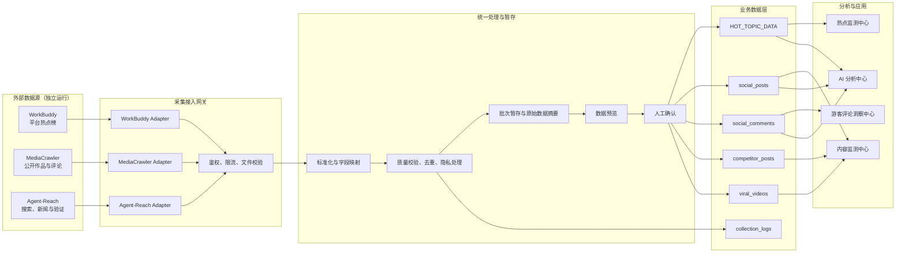
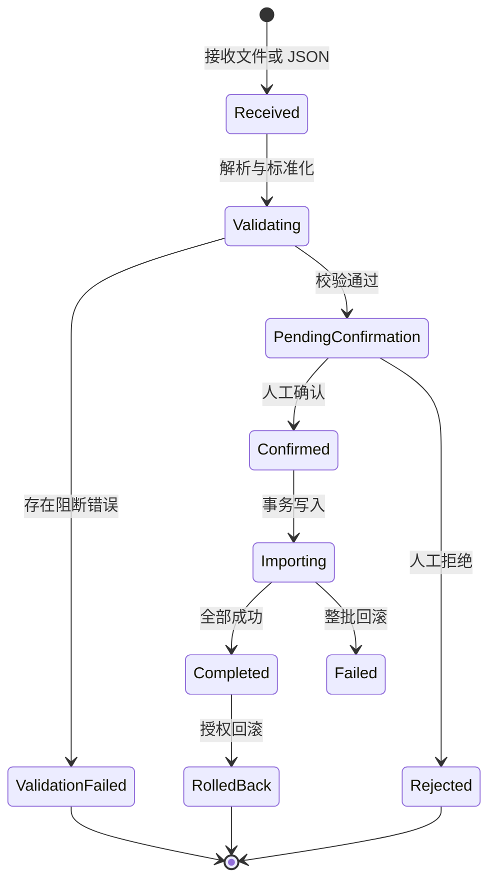

# 新媒体数据采集中心 V2.0 架构设计

> 项目：独山子大峡谷 AI 营销中台
>
> 文档版本：V2.0
>
> 设计日期：2026-08-11（Asia/Shanghai）
>
> 本阶段范围：仅完成架构设计与接口规划；不安装 MediaCrawler 依赖、不启动采集任务、不修改现有业务模块和数据库。

## 1. 建设目标

数据采集中心 V2.0 统一管理三类外部数据能力：

- **WorkBuddy**：提供抖音热点、快手热点和微博热搜等平台榜单快照；
- **MediaCrawler**：提供公开作品、公开互动指标、公开评论和爆款候选内容；
- **Agent-Reach**：提供全网趋势、新闻背景和热点来源验证。

V2.0 建设的是统一的“采集控制面”和“数据接入规范”，不是把三个工具合并成一个爬虫。各工具继续独立运行，中台负责接收、校验、预览、人工确认、存储、分析、展示和审计。

### 1.1 设计原则

1. **采集与业务解耦**：外部工具不得直接写入生产业务表。
2. **来源可追溯**：每条数据必须记录来源工具、来源类型、采集批次和原始标识。
3. **先预览后入库**：校验通过只进入待确认状态，人工确认后才能写入业务表。
4. **数据语义隔离**：官方榜单、公开内容热度和全网搜索线索不得混为同一指标。
5. **幂等写入**：同一来源记录重复导入时更新或跳过，不产生重复业务数据。
6. **失败不污染**：解析、校验或转换失败时，不产生部分业务写入。
7. **最小权限**：中台不接收平台账号密码；Cookie、二维码登录态留在采集端本机。
8. **渐进实施**：本阶段只定义架构与契约，后续按许可、测试和验收结果逐步接入。

## 2. 模块信息架构

```text
数据采集中心 V2.0
├── 热点采集
│   ├── 抖音热点
│   ├── 快手热点
│   └── 微博热搜
│       来源：WorkBuddy
├── 内容采集
│   ├── 视频采集
│   ├── 评论采集
│   └── 爆款内容库
│       来源：MediaCrawler
├── 信息补充
│   ├── 全网趋势
│   ├── 新闻信息
│   └── 热点验证
│       来源：Agent-Reach
└── 采集日志
    ├── 批次记录
    ├── 校验结果
    ├── 入库结果
    └── 失败与回滚记录
```

### 2.1 热点采集模块

定位：管理 WorkBuddy 提供的平台热榜快照，不在中台内执行热点抓取。

| 功能 | 输入 | 输出 | 目标数据 |
|---|---|---|---|
| 抖音热点 | WorkBuddy JSON/Excel | 排名、标题、热度、关键词、链接、时间 | `HOT_TOPIC_DATA` |
| 快手热点 | WorkBuddy JSON/Excel | 排名、标题、热度、关键词、链接、时间 | `HOT_TOPIC_DATA` |
| 微博热搜 | WorkBuddy JSON/Excel | 排名、标题、热度、关键词、链接、时间 | `HOT_TOPIC_DATA` |
| 热点 AI 分析 | 热点、景区资源、历史作品 | 关联评分、是否跟进、选题和拍摄建议 | `HOT_TOPIC_DATA` AI 字段 |

当前 `/api/hot-topic/import` 已具备 WorkBuddy JSON/Excel 导入能力，V2.0 应优先复用，避免重复建设。该接口的数据必须继续标记为 `WorkBuddy热点监测Agent`，不能接收 Agent-Reach 搜索结果。

### 2.2 内容采集模块

定位：管理 MediaCrawler 输出的公开作品和评论文件，不在本阶段安装或运行 MediaCrawler。

| 功能 | 采集模式 | 推荐目标 | 说明 |
|---|---|---|---|
| 视频采集 | `search`、`detail`、`creator` | `social_posts` 或 `competitor_posts` | 自有账号与外部账号必须分流 |
| 评论采集 | 作品一级/二级公开评论 | `social_comments` | 必须先完成作品关联和用户脱敏 |
| 爆款内容库 | 关键词搜索或指定作品 | `viral_videos` | 保存爆款结构分析所需样本 |

内容采集只处理公开数据，不能替代创作者后台。完播率、划走率、平均观看时长、流量来源、观众画像和粉丝趋势等私域指标不得由缺失字段推测生成。

### 2.3 信息补充模块

定位：将 Agent-Reach 作为搜索、读取和验证能力层，为热点分析增加上下文，不作为平台官方榜单源。

| 功能 | 推荐能力 | 业务输出 |
|---|---|---|
| 全网趋势 | Exa、RSS、公开视频检索 | 趋势线索、相关事件、多来源摘要 |
| 新闻信息 | Jina Reader、RSS | 新闻正文摘要、发布日期、来源机构、原文链接 |
| 热点验证 | 多来源交叉搜索与网页读取 | 真实性、时效性、来源数量、冲突信息和验证结论 |

Agent-Reach 当前没有抖音、快手、微博专用官方热榜通道，因此其结果必须标记为 `web_intelligence` 或 `verification_evidence`，不能填写虚构的官方排名和平台热度。

### 2.4 采集日志模块

统一展示三类工具的批次状态和处理结果：

- 数据源与工具版本；
- 任务类型、平台、数据范围和来源文件；
- 接收数、有效数、重复数、失败数、确认入库数；
- 失败字段、失败原因和错误样本；
- 创建、预览、确认、写入、回滚时间；
- 操作人或调用方标识；
- 业务表写入结果与可回滚批次号。

现有 `collection_logs` 可继续承载基础批次信息。若后续需要保存逐行错误、原始文件摘要和审批人，建议另建明细/暂存表，不在本设计阶段修改数据库。

## 3. 与现有系统的关系

### 3.1 职责边界

| 组件 | 负责 | 不负责 |
|---|---|---|
| WorkBuddy | 三平台榜单采集和排名快照 | 作品详情、评论批量采集 |
| MediaCrawler | 公开作品、互动指标、评论和爆款候选 | 创作者后台私域指标、官方热榜 |
| Agent-Reach | 全网搜索、新闻读取、来源验证 | 伪装为平台榜单、直接写业务表 |
| 数据采集中心 | 接收、校验、预览、确认、路由、日志 | 保存账号密码、在页面进程内运行爬虫 |
| 热点监测中心 | 展示 `HOT_TOPIC_DATA` 和 AI 热点分析 | 直接控制采集工具 |
| 内容监测中心 | 展示作品、竞品和爆款分析 | 直接读取采集器原始文件 |
| 游客评论洞察中心 | 分析已确认的 `social_comments` | 接收未关联作品的原始评论 |

### 3.2 数据目标映射

| 数据类型 | 来源 | 业务目标 | 写入条件 |
|---|---|---|---|
| 平台热点榜 | WorkBuddy | `HOT_TOPIC_DATA` | 平台、排名、标题、采集时间有效 |
| 自有账号公开作品 | MediaCrawler | `social_posts` | 账号授权、字段校验、人工确认 |
| 外部账号作品 | MediaCrawler | `competitor_posts` | 来源合法、账号与作品可追溯 |
| 旅游爆款样本 | MediaCrawler | `viral_videos` | 达到爆款规则并人工确认 |
| 公开评论 | MediaCrawler | `social_comments` | 作品存在、评论去重、隐私处理完成 |
| 全网趋势线索 | Agent-Reach | 规划中的暂存/证据层 | 标明非官方排名，不直接进入热点榜 |
| 新闻与验证证据 | Agent-Reach | 规划中的热点证据层 | URL、来源、抓取时间、摘要完整 |

### 3.3 不影响现有模块的方式

- 不改变现有页面路由和业务查询；
- 不修改 `social_posts`、`social_comments`、`HOT_TOPIC_DATA` 等表结构；
- 不替换现有抖音人工确认采集流程；
- 新接口先作为独立适配层规划，完成验收后再由数据采集中心调用；
- 业务模块只读取已确认的业务表，不感知外部工具命令和运行状态。

## 4. 推荐总体架构



### 4.1 部署边界

推荐采用“本地采集端主动上传、中台不反向控制本机”的方式：

1. WorkBuddy、MediaCrawler 和 Agent-Reach 在授权环境独立运行；
2. 采集端生成 JSON/Excel 或标准 JSON 批次；
3. 操作人员手工上传，或本地适配器通过 HTTPS 主动推送；
4. 云端中台不能直接访问本机 `localhost`、Chrome 登录态或桌面目录；
5. Cookie、二维码登录态和浏览器用户目录不离开采集设备。

## 5. 统一数据契约

所有规划接口使用统一批次信封。`payload.records` 的业务字段由数据类型决定，公共元数据保持一致。

```json
{
  "schema_version": "2.0",
  "batch_id": "wb-hot-topic-20260811-080000",
  "source_tool": "workbuddy",
  "source_name": "WorkBuddy热点监测Agent",
  "source_version": "unknown",
  "data_kind": "hot_topic_rank",
  "platform": "douyin",
  "collected_at": "2026-08-11T08:00:00+08:00",
  "range": {
    "start": "2026-08-11T00:00:00+08:00",
    "end": "2026-08-11T08:00:00+08:00"
  },
  "payload": {
    "records": []
  },
  "integrity": {
    "record_count": 0,
    "sha256": ""
  }
}
```

### 5.1 公共枚举

| 字段 | 允许值 |
|---|---|
| `source_tool` | `workbuddy`、`mediacrawler`、`agent_reach` |
| `platform` | `douyin`、`kuaishou`、`weibo`、`web` |
| `data_kind` | `hot_topic_rank`、`public_post`、`public_comment`、`viral_candidate`、`trend_signal`、`news_item`、`verification_evidence` |
| `status` | `received`、`validating`、`validation_failed`、`pending_confirmation`、`confirmed`、`importing`、`completed`、`failed`、`rolled_back` |

### 5.2 数据质量字段

每条标准记录应附带：

- `source_record_id`：外部工具内的原始唯一标识；
- `source_url`：可回溯的原始页面；
- `raw_payload`：原始字段或其受控副本；
- `field_completeness`：字段完整率；
- `validation_warnings`：缺失、格式或语义警告；
- `is_official_rank`：是否为平台榜单数据；
- `confidence`：来源验证置信度，不等同热点热度；
- `dedupe_key`：平台、数据类型和来源标识生成的稳定键。

## 6. 接口规划

> 以下接口均为 V2.0 规划，当前阶段不实现、不调用。

### 6.1 统一批次接口

#### `POST /api/data-collection/v2/batches`

用途：接收标准 JSON 批次或上传 JSON/Excel 文件，完成解析和校验，创建待确认批次。

请求：

- `application/json`：统一批次信封；
- `multipart/form-data`：`file`、`source_tool`、`data_kind`、`platform`；
- 请求头 `X-Collector-Key`；
- 可选 `Idempotency-Key`，建议与 `batch_id` 一致。

成功响应示例：

```json
{
  "batch_id": "mc-public-post-20260811-001",
  "status": "pending_confirmation",
  "received_count": 30,
  "valid_count": 27,
  "duplicate_count": 2,
  "error_count": 1,
  "preview_url": "/api/data-collection/v2/batches/mc-public-post-20260811-001/preview"
}
```

错误响应必须包含逐行错误，但不得产生业务表写入。

#### `GET /api/data-collection/v2/batches`

用途：采集日志列表。

筛选参数：`source_tool`、`platform`、`data_kind`、`status`、`start_date`、`end_date`、`page`、`page_size`。

#### `GET /api/data-collection/v2/batches/{batch_id}`

用途：返回批次摘要、转换结果、字段完整率、失败原因和确认状态。

#### `GET /api/data-collection/v2/batches/{batch_id}/preview`

用途：分页返回标准化后的待写入记录和原始字段差异，不包含未脱敏的敏感信息。

#### `POST /api/data-collection/v2/batches/{batch_id}/confirm`

用途：人工确认后执行事务性写入。

```json
{
  "confirmed_by": "operator-id",
  "target": "viral_videos",
  "accepted_record_ids": ["record-1", "record-2"]
}
```

服务端必须再次校验批次状态和数据摘要，防止预览后文件被替换。

#### `POST /api/data-collection/v2/batches/{batch_id}/rollback`

用途：按 `collection_log_id` 回滚该批次产生的数据，并保留审计日志。只有已完成且支持安全回滚的批次可调用。

### 6.2 WorkBuddy 适配接口

#### 复用 `POST /api/hot-topic/import`

现状：已支持 JSON、XLSX、XLS，带 Agent Key 校验，可写入 `HOT_TOPIC_DATA` 并进行规则 AI 分析。

V2.0 规划：

- 数据采集中心将其包装为“热点采集”入口；
- 保留 WorkBuddy 原始接口，避免破坏已有接入；
- 将调用结果同步形成统一批次日志；
- 后续可增加预览与确认模式，但不改变旧客户端默认行为前必须提供版本兼容策略；
- `source_agent` 固定为 WorkBuddy，不允许其他来源冒用。

### 6.3 MediaCrawler 适配接口

#### `POST /api/data-collection/v2/mediacrawler/import`

用途：导入 MediaCrawler 已生成的 JSON、JSONL、CSV 或 Excel 文件。该接口不启动 MediaCrawler。

建议参数：

- `platform`：`douyin`、`kuaishou`、`weibo`；
- `crawler_type`：`search`、`detail`、`creator`；
- `entity_type`：`post`、`comment`；
- `target`：`social_posts`、`competitor_posts`、`viral_videos`、`social_comments`；
- `account_authorized`：写入自有账号数据时必须为 `true`；
- `file`：采集器输出文件。

处理规则：

1. 只解析文件，不执行 Python 命令；
2. 根据平台和输出版本选择字段映射器；
3. 作品使用平台原始 ID 或规范化 URL 去重；
4. 评论必须关联到已存在或同批待确认的作品；
5. 缺失播放量等字段保持“未知”，不能伪造；
6. 用户标识保持 MediaCrawler 的脱敏结果；
7. 完成预览和人工确认后才进入业务表。

#### 可选本地桥接协议（后续阶段）

本地桥接器可读取 MediaCrawler 输出目录并主动调用统一批次接口。中台不直接调用其本地 `/api/crawler/start`，也不在云端保存 Cookie。若未来确需控制任务，应建立独立、受认证的本地 Agent，禁止把 MediaCrawler 默认 WebUI 直接暴露到公网。

### 6.4 Agent-Reach 适配接口

#### `POST /api/data-collection/v2/agent-reach/evidence`

用途：导入已经执行完成的搜索、网页读取、RSS 或验证结果。该接口不执行 Agent-Reach CLI。

记录示例：

```json
{
  "evidence_id": "sha256:...",
  "evidence_type": "news_item",
  "query": "新疆旅游 暑期 自驾",
  "title": "示例新闻标题",
  "url": "https://example.com/news/1",
  "publisher": "示例媒体",
  "published_at": "2026-08-11T07:30:00+08:00",
  "retrieved_at": "2026-08-11T08:10:00+08:00",
  "summary": "经适配器生成的摘要",
  "content_hash": "sha256:...",
  "related_topic_ids": [123],
  "verification": {
    "source_count": 3,
    "conflict_found": false,
    "confidence": 0.86
  }
}
```

处理规则：

- 搜索排名不映射为平台热点排名；
- `confidence` 不映射为 `heat_value`；
- 证据关联热点，但不覆盖 WorkBuddy 原始榜单；
- 新闻正文只保存必要摘要、来源和内容哈希，避免大段复制；
- URL 必须通过协议、域名、重定向和私网地址安全检查。

### 6.5 查询接口

| 接口 | 用途 |
|---|---|
| `GET /api/data-collection/v2/health` | 返回三个适配器配置状态，不主动访问外部平台 |
| `GET /api/data-collection/v2/sources` | 返回工具、能力、许可证状态和最后成功批次 |
| `GET /api/data-collection/v2/logs` | 统一采集日志查询 |
| `GET /api/data-collection/v2/metrics` | 批次数、成功率、重复率、字段完整率、最新时间 |

健康状态应区分 `configured`、`not_configured`、`license_blocked`、`disabled`，不能因为未安装 MediaCrawler 就显示系统故障。

## 7. 页面规划

本阶段不修改页面，后续实施时建议保留现有数据采集中心入口，内部增加四个 Tab。

### 7.1 热点采集

- 来源卡片：WorkBuddy、状态、最后导入时间；
- 平台卡片：抖音、快手、微博；
- 最近文件/批次、记录数量、错误数量；
- “预览数据”“确认入库”“查看日志”；
- 明确显示“由 WorkBuddy 采集，中台仅接收”。

### 7.2 内容采集

- 来源卡片：MediaCrawler；
- 任务类型：视频、评论、爆款候选；
- 文件上传和字段映射预览；
- 自有作品、竞品作品、爆款库的目标选择；
- 许可证未确认时显示“仅技术评估，生产接入禁用”。

### 7.3 信息补充

- 来源卡片：Agent-Reach；
- 类型筛选：全网趋势、新闻、热点验证；
- 关联的热点、来源数量、时效性和验证状态；
- 原文链接和验证证据；
- 明确显示“非平台官方榜单”。

### 7.4 采集日志

- 工具、平台、类型、状态和日期筛选；
- 接收/有效/重复/失败/入库数量；
- 字段完整率和失败原因；
- 查看预览、确认记录和回滚结果；
- 不在日志页面显示 Cookie、Token、二维码或完整个人标识。

## 8. 关键流程

### 8.1 通用导入流程



### 8.2 去重建议

| 数据 | 首选幂等键 | 备选键 |
|---|---|---|
| WorkBuddy 热点 | 来源 + 平台 + 标题 + 发布时间 | 来源 + 平台 + 排名 + 采集日期 |
| MediaCrawler 作品 | 平台 + 原始作品 ID | 平台 + 规范化作品 URL |
| MediaCrawler 评论 | 平台 + 原始评论 ID | 作品 ID + 用户哈希 + 正文哈希 + 时间 |
| Agent-Reach 证据 | 规范化 URL + 内容哈希 | 来源域名 + 标题 + 发布时间 |

## 9. 安全、合规与风险控制

### 9.1 MediaCrawler 许可证

当前本机版本使用“非商业学习使用许可证 1.1”。在未获得版权所有者书面商业授权前：

- 不得用于景区正式商业运营采集；
- 不得部署为生产自动任务；
- V2.0 页面和接口应保持禁用或仅允许离线结构验证；
- 授权结论、允许平台和允许规模应纳入上线审批记录。

这是 MediaCrawler 正式接入的首要阻断项。

### 9.2 平台与账号风险

- 遵守平台服务协议、robots 规则、隐私政策和适用法律；
- 限速、限制并发和采集范围，不进行大规模抓取；
- 使用专用授权账号，避免影响景区主账号；
- 不采集作者回复以外的敏感身份信息，不建立游客个人画像；
- 平台页面或接口变化时立即停止异常任务，先更新适配器测试。

### 9.3 凭据风险

- Cookie、Token 和浏览器配置文件仅保留在采集端；
- 禁止通过 MediaCrawler REST 请求传递 Cookie，避免命令参数进入日志；
- API Key 使用环境变量或密钥服务，不写入代码和采集文件；
- 上传日志对请求头、文件路径、URL 参数和错误堆栈进行脱敏。

### 9.4 数据语义风险

- WorkBuddy 榜单排名、MediaCrawler 公开互动量和 Agent-Reach 搜索线索是三种不同数据；
- 缺失字段不能用 0 冒充真实值，必须保存缺失状态；
- 热度、关联度、置信度和 AI 评分分别展示，禁止混用；
- AI 建议必须保留来源和规则版本，并标注为辅助决策。

### 9.5 接口风险

- 文件大小、记录数、嵌套深度、MIME 和扩展名均需限制；
- Excel 需防范公式注入，导出时对 `= + - @` 开头文本转义；
- Agent-Reach URL 需防止 SSRF 和内网地址访问；
- 批量写入必须使用事务或 D1 Batch，失败时整批回滚；
- 接口启用鉴权、幂等键、限流、重放保护和审计日志。

## 10. 分阶段实施建议

### 阶段 A：契约与样本验证

- 冻结统一批次信封和三类字段映射；
- 使用脱敏静态样本验证 JSON/Excel 解析；
- 不安装或运行外部工具；
- 验证预览、错误报告和幂等规则设计。

### 阶段 B：WorkBuddy 统一纳管

- 复用现有 `/api/hot-topic/import`；
- 将导入结果汇总到统一采集日志视图；
- 不改变热点监测中心现有查询和 AI 分析。

### 阶段 C：MediaCrawler 离线文件接入

- 前置条件：取得商业授权并完成平台合规审核；
- 只接入已经生成的文件，不在中台启动采集器；
- 先验证抖音，稳定后再分别评估快手和微博；
- 所有数据继续走预览和人工确认。

### 阶段 D：Agent-Reach 证据接入

- 先接入新闻/RSS/网页来源摘要；
- 建立热点与证据的多对多关联；
- AI 分析引用证据，不修改 WorkBuddy 原始榜单数据；
- 验证结果与原始热点分别展示。

### 阶段 E：受控自动化

- 仅在许可证、平台授权、安全和数据质量均达标后考虑；
- 本地适配器主动上传，不开放本机服务到公网；
- 设置每日上限、失败熔断、告警和人工停用开关；
- 定期审计采集账号、日志、数据保留和删除策略。

## 11. 验收标准

| 类别 | 验收要求 |
|---|---|
| 隔离性 | 外部工具无法直接写业务表，现有模块代码和行为不变 |
| 可追溯性 | 每条业务数据可追溯到工具、批次、原始标识和采集时间 |
| 数据质量 | 必填字段完整率 100%，整体字段完整率可量化，缺失不伪造 |
| 幂等性 | 同一批次重复提交不新增重复记录 |
| 原子性 | 校验或写入失败时不产生部分业务数据 |
| 人工确认 | 未确认批次不进入业务表 |
| 安全性 | 日志和响应不包含 Cookie、Token、密码或未脱敏身份信息 |
| 语义准确 | 官方榜单、公开内容和全网线索可明确区分 |
| 兼容性 | 现有 WorkBuddy 导入、热点监测和内容监测查询不受影响 |
| 合规性 | MediaCrawler 商业授权与平台合规审核完成后才允许生产启用 |

## 12. 本阶段交付边界

本次只交付本架构文档和接口规划：

- 不安装 Agent-Reach 或 MediaCrawler 依赖；
- 不运行 WorkBuddy、MediaCrawler 或 Agent-Reach 采集任务；
- 不新增或修改页面、API、数据库迁移和业务代码；
- 不改变现有热点、内容、评论、粉丝和 OTA 模块；
- 不向任何平台发起请求；
- 不写入或清理任何业务数据。

后续开发必须从“阶段 A：契约与样本验证”开始，并以 MediaCrawler 许可证审核作为内容采集生产接入的前置条件。
