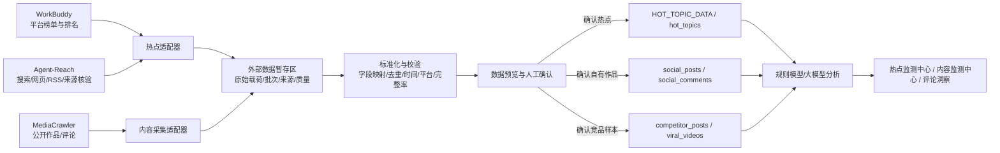

# Agent-Reach 与 MediaCrawler 数据接入技术评估

> 项目：独山子大峡谷 AI 营销中台  
> 评估日期：2026-08-11（Asia/Shanghai）  
> 评估方式：仅阅读本机已下载项目的源码、配置、文档和许可证；未安装依赖、未启动爬虫、未访问目标平台、未修改营销中台代码。  
> 代码快照：Agent-Reach `1221ecd`（v1.5.0）；MediaCrawler `071c8c0`（项目版本 0.1.0）。

## 结论摘要

1. **Agent-Reach 适合作为互联网搜索、网页读取、来源核验与 Agent 能力路由层，不适合作为抖音、快手、微博官方热榜采集器。** 当前代码没有抖音、快手、微博专用 Channel，也没有统一的数据采集服务 API；其价值是为热点候选补充全网证据、原文和背景信息。
2. **MediaCrawler 适合作为公开作品、公开互动指标和评论的采集执行器。** 它支持抖音、快手、微博等七个平台，具备关键词、指定作品、创作者主页和评论采集能力，但不等同于创作者后台数据接口，不能提供完整的完播率、划走率、流量来源、观众画像、粉丝增长等私域指标。
3. **两者都不应直接连接生产数据库。** 推荐增加独立的“采集适配与暂存层”，统一做字段映射、来源标注、去重、质量校验、预览和人工确认，再写入营销中台。
4. **MediaCrawler 当前许可证是“非商业学习使用许可证 1.1”。** 未取得版权所有者书面授权前，不建议把它用于景区正式商业运营或生产自动采集。这是本次评估的首要上线阻断项。
5. 现阶段建议继续让 WorkBuddy 提供平台热点排名；Agent-Reach 负责热点来源核验和全网补充；MediaCrawler 只在完成许可审核后作为内容与评论的候选采集器。

---

## 一、工具定位

### 1. Agent-Reach

#### 1.1 功能定位

Agent-Reach 的 README 明确将其定义为 **capability layer（能力层）**，主要负责：

- 选择各平台当前可用的上游工具；
- 安装、配置和健康检查；
- 为同一平台维护首选与备选后端顺序；
- 向 AI Agent 提供调用说明；
- 通过 `agent-reach doctor` 输出渠道可用性和当前后端。

它不是统一爬虫，也不是把所有渠道封装成一个业务 API。除少量内置读取类外，实际搜索和读取通常由 Agent 直接调用 `mcporter`、`opencli`、`twitter`、`bili`、`gh`、`curl` 等上游命令。

#### 1.2 当前支持能力

| 能力类别 | 当前项目提供的路径 | 对本项目的价值 |
|---|---|---|
| 全网搜索 | Exa MCP，经 `mcporter` 调用 | 搜集旅游、新疆、自驾、景区等热点候选 |
| 网页读取 | Jina Reader | 读取新闻、榜单说明、事件原文，核验来源 |
| RSS | `feedparser` | 订阅文旅部门、媒体、行业站点更新 |
| GitHub | `gh` | 与营销数据无直接关系，可用于技术情报 |
| Twitter/X、Reddit、Facebook、Instagram | CLI 或 OpenCLI，部分依赖登录态 | 可作为境外旅游舆情补充，不是当前三平台主数据源 |
| YouTube、B站 | 视频搜索、详情或字幕 | 可用于旅游视频选题研究和海外内容参考 |
| 小红书 | OpenCLI / MCP / CLI 多后端 | 可作为未来“小红书内容趋势”扩展来源 |
| V2EX、雪球、LinkedIn、小宇宙 | 各自专用后端 | 与当前景区热点业务关联较弱 |

**关键边界：当前源码没有抖音、快手、微博专用 Channel。** 因此 Agent-Reach 无法直接保证获得三平台官方热榜、官方排名或平台内部热度指标。

#### 1.3 适用场景

推荐：

- 对 WorkBuddy 热点的标题、链接和事件背景做二次核验；
- 搜索同一事件的多来源报道，降低单来源误判；
- 获取旅游、新疆、自驾、户外、摄影等全网趋势线索；
- 为 AI 热点分析补充“事件发生了什么、来源是否可靠、是否仍在持续”等上下文；
- 订阅行业 RSS，形成低风险、可追踪的信息源。

不推荐：

- 作为抖音、快手、微博官方榜单的唯一数据源；
- 将搜索结果顺序当成平台官方排名；
- 将网页搜索热度当成平台官方热度；
- 直接写入 `HOT_TOPIC_DATA` 并标记为“抖音热榜/快手热榜/微博热搜”。

#### 1.4 接口方式

| 方式 | 可用性 | 说明 |
|---|---|---|
| CLI | 主要方式 | `agent-reach doctor --json` 用于健康检查；真实数据读取多为调用上游 CLI |
| MCP | 间接支持 | Exa、小红书、LinkedIn 等通过 `mcporter` 连接对应 MCP 服务 |
| Python API | 有限 | `AgentReach` 类只提供 `doctor()` 和 `doctor_report()`，不是统一搜索/采集 API |
| HTTP API | 未提供 | 项目本身没有常驻 HTTP 数据服务 |
| 输出格式 | 不统一 | Doctor 可输出 JSON；OpenCLI 示例常用 YAML；Jina 返回文本；其他 CLI 各有自己的格式 |

因此，接入营销中台前必须有独立适配器，把不同上游输出规范化为统一 JSON。

### 2. MediaCrawler

#### 2.1 功能定位

MediaCrawler 是基于 Python 异步编程、Playwright/CDP 和平台请求客户端实现的多平台公开数据采集框架。它通过浏览器登录态完成搜索、详情和评论请求，并把结果写入文件或数据库。

#### 2.2 支持平台

| 平台 | 代号 | 关键词搜索 | 指定作品 | 创作者主页 | 一级评论 | 二级评论 |
|---|---:|---:|---:|---:|---:|---:|
| 小红书 | `xhs` | 支持 | 支持 | 支持 | 支持 | 支持 |
| 抖音 | `dy` | 支持 | 支持 | 支持 | 支持 | 支持 |
| 快手 | `ks` | 支持 | 支持 | 支持 | 支持 | 支持 |
| B站 | `bili` | 支持 | 支持 | 支持 | 支持 | 支持 |
| 微博 | `wb` | 支持 | 支持 | 支持 | 支持 | 支持 |
| 百度贴吧 | `tieba` | 支持 | 支持 | 支持 | 支持 | 支持 |
| 知乎 | `zhihu` | 支持 | 支持 | 支持 | 支持 | 支持 |

本中台当前仅保留抖音、快手、微博，因此首期只应评估 `dy`、`ks`、`wb`，不要把小红书等平台自动带入现有业务口径。

#### 2.3 采集能力与边界

MediaCrawler 支持三种任务：

- `search`：按关键词搜索公开内容；
- `detail`：按作品 ID 或链接采集详情；
- `creator`：按创作者 ID 或主页链接采集其公开作品。

还支持：

- 二维码、手机号或 Cookie 登录；
- Playwright 模式或连接本机 Chrome 的 CDP 模式；
- 一级/二级评论采集和单作品评论上限；
- 并发数、抓取数量、起始页和代理设置；
- 可选图片、视频下载；
- CSV、JSON、JSONL、Excel、SQLite、MySQL、PostgreSQL、MongoDB 等存储方式（具体可用项以当前 CLI 与依赖为准）；
- WebUI、REST 控制接口、日志和 WebSocket 状态推送。

但开源教学版有以下限制：

- 抖音、快手、微博的 `save_creator()` 当前均为空操作，出于隐私和防骚扰目的不持久化创作者个人资料；
- 昵称会脱敏，用户 ID 会转换为匿名哈希；
- 公开作品数据不等于创作者后台数据；
- 抖音公开存储字段没有播放量，快手有 `viewd_count`，微博没有播放量；
- 不提供完播率、划走率、平均观看时长、流量来源、观众年龄/地域/性别、粉丝增长趋势等后台分析字段；
- 不能替代当前抖音创作者中心 V3.0 的私域数据采集流程。

#### 2.4 数据格式

MediaCrawler 默认写 JSONL，也可写 JSON、CSV、Excel 或数据库。Excel 按 Contents、Comments、Creators 等工作表组织；但当前抖音/快手/微博教学版不会实际落库 Creator 资料。

三平台关键字段如下：

| 业务含义 | 抖音输出 | 快手输出 | 微博输出 |
|---|---|---|---|
| 作品唯一标识 | `aweme_id` | `video_id` | `note_id` |
| 标题/正文 | `title` / `desc` | `title` / `desc` | `content` |
| 发布时间 | `create_time` | `create_time` | `create_time` / `create_date_time` |
| 作品链接 | `aweme_url` | `video_url` | `note_url` |
| 封面 | `cover_url` | `video_cover_url` | 当前标准记录无统一封面字段 |
| 播放量 | **缺失** | `viewd_count`（源码字段拼写） | **缺失** |
| 点赞 | `liked_count` | `liked_count` | `liked_count` |
| 评论数 | `comment_count` | 当前标准作品记录未稳定提供 | `comments_count` |
| 收藏 | `collected_count` | 缺失 | 缺失 |
| 分享 | `share_count` | 当前标准作品记录未稳定提供 | `shared_count` |
| 搜索来源词 | `source_keyword` | `source_keyword` | `source_keyword` |
| 评论正文 | `content` | `content` | `content` |
| 评论点赞 | `like_count` | 当前标准评论记录缺失 | `comment_like_count` |
| 评论用户 | 脱敏 `nickname` + `creator_hash` | 脱敏 `nickname` + `creator_hash` | 脱敏 `nickname` + `creator_hash` |

#### 2.5 接口方式

1. **命令行**：`main.py --platform ... --type ...`，功能最完整。
2. **本地 REST API**：FastAPI 默认端口 8080：
   - `POST /api/crawler/start`：启动任务；
   - `POST /api/crawler/stop`：停止任务；
   - `GET /api/crawler/status`：读取状态；
   - `GET /api/crawler/logs`：读取日志；
   - `GET /api/data/files`：列出 JSON/CSV/XLSX/XLS 文件；
   - `GET /api/data/files/{path}`：预览文件；
   - `GET /api/data/download/{path}`：下载文件；
   - WebSocket `/api/ws/logs`、`/api/ws/status`：实时日志和状态。
3. **文件交换**：JSONL/JSON/CSV/Excel，最适合与现有“预览—确认—入库”流程解耦。
4. **数据库交换**：可写 SQLite 等数据库，但不建议让它直接写营销中台 D1。

注意：默认输出是 JSONL，而当前 `/api/data/files` 只枚举 JSON、CSV、XLSX、XLS，不包含 JSONL。若通过其 REST 数据接口取文件，应显式使用 JSON 或 Excel；若使用 JSONL，应由独立适配器直接读取输出目录。

---

## 二、和现有新媒体中心关系

### 1. 能力分工

| 系统/工具 | 应承担的职责 | 不应承担的职责 |
|---|---|---|
| WorkBuddy 热点监测 Agent | 抖音、快手、微博榜单数据和排名快照 | 内容详情与大量评论采集 |
| Agent-Reach | 全网搜索、网页读取、来源核验、背景补充、RSS | 冒充官方热榜、直接产生平台官方排名 |
| MediaCrawler | 公开作品、公开互动指标、公开评论、竞品/爆款样本 | 创作者后台私域指标、粉丝画像、官方平台热榜 |
| AI 营销中台 | 接收、校验、预览、人工确认、存储、AI 分析、业务展示 | 在前端请求中直接运行爬虫或保存账号 Cookie |

### 2. Agent-Reach 与热点监测中心

现有热点中心使用 `HOT_TOPIC_DATA`，页面读取平台、排名、标题、热度、关键词、链接、采集时间、来源 Agent 和 AI 分析。现有 `/api/hot-topic/import` 虽然接收 JSON/Excel，但路由逻辑把 `source_agent` 固定为 `WorkBuddy热点监测Agent`。

因此：

- **Agent-Reach 当前不能直接调用该接口并保留正确来源标识**；否则会把 Agent-Reach 数据误标为 WorkBuddy。
- Agent-Reach 的搜索结果通常没有官方 `rank` 和可信的官方 `heat_value`，也不应硬填成榜单数据。
- 推荐把 Agent-Reach 结果定义为“全网热点线索/来源证据”，用于补充热点详情和核验，而不是覆盖 WorkBuddy 榜单。

推荐的业务映射：

| Agent-Reach 结果 | 中台用途 |
|---|---|
| Exa 搜索结果 | 热点候选、相关报道、持续时间和多来源证据 |
| Jina 网页正文 | AI 分析上下文、来源摘要、风险核验 |
| RSS 条目 | 行业趋势和官方机构更新 |
| B站/YouTube搜索 | 旅游视频选题参考、爆款表达形式补充 |
| 小红书搜索（未来） | 种草趋势与游客需求线索，单独标注平台和登录来源 |

### 3. MediaCrawler 与内容监测中心

MediaCrawler 的公开内容和评论可映射到：

- 自有账号且经过授权、确认的数据 → `social_posts`、`social_comments`；
- 同行业/其他账号公开作品 → `competitor_posts`；
- 旅游、景区、新疆、自然风景爆款样本 → `viral_videos`；
- 采集批次状态、成功数、失败数 → `collection_logs`；
- 原始未转换数据 → `raw_payload` 或独立暂存区。

不应映射到：

- `social_fans`、`fan_growth_records`：开源教学版不持久化创作者资料，也没有粉丝趋势；
- `content_audience_analysis`：没有作品观众年龄、地域、性别；
- `social_posts.completion_rate`、`skip_rate`、`average_play_duration`、`traffic_sources`：公开采集不提供这些创作者后台指标。

### 4. 字段映射建议

#### 4.1 抖音作品

| MediaCrawler | 中台 | 处理规则 |
|---|---|---|
| `aweme_id` | `source_record_id`（建议） | 与平台共同构成幂等键 |
| `title` | `title` | 必填，空值拒绝 |
| `create_time` | `publish_time` | Unix 时间转换为北京时间 ISO 8601 |
| `aweme_url` | `video_url` | 规范化短链/长链 |
| `cover_url` | `cover_url` | 可空 |
| `liked_count` | `likes` | 字符串转非负整数 |
| `comment_count` | `comments` | 字符串转非负整数 |
| `collected_count` | `favorites` | 字符串转非负整数 |
| `share_count` | `shares` | 字符串转非负整数 |
| 缺失 | `views` | 必须标记为缺失，不能填造真实值；若数据库要求非空，只能写 0 并附质量标记 |
| `source_keyword` | `hashtags` 或 `raw_payload` | 不等同作品标签，建议保存在原始字段或独立检索词字段 |

#### 4.2 评论

| MediaCrawler | 中台 | 处理规则 |
|---|---|---|
| `aweme_id` / `video_id` / `note_id` | `post_id` | 先通过平台作品 ID/链接关联作品 |
| `nickname` | `username` | 已脱敏，页面需标明 |
| `content` | `comment_text` | 空内容拒绝 |
| `create_time` | `comment_time` | 统一 ISO 8601 |
| `like_count` / `comment_like_count` | `likes` | 缺失时写 0 并保留质量标记 |
| `comment_id` | 建议新增来源唯一键或暂存键 | 防止重复写入 |
| `parent_comment_id` | 暂存/扩展字段 | 用于过滤作者回复和二级评论 |

#### 4.3 竞品与爆款

- `search` 模式适合按“新疆旅游、景区、自驾、峡谷、亲子、自然风景”等关键词建立候选样本；
- `creator` 模式适合采集已明确授权或公开研究的账号作品，但当前 Creator 资料不落库；
- 其他账号数据优先进入 `competitor_posts` 或 `viral_videos`，不要混入代表景区自有账号的 `social_posts`；
- 爆款原因、视频结构、前三秒、拍摄方式等不是 MediaCrawler 原始字段，应由中台 AI 在入库后分析，不应由采集器伪造。

---

## 三、推荐架构



### 架构原则

1. **采集进程与营销中台隔离**：MediaCrawler 和 Agent-Reach 在本机或专用采集主机运行，不嵌入 Cloudflare/Sites 前端或 API Worker。
2. **只通过受控导入接口交换数据**：采集器不持有 D1 数据库直连权限。
3. **原始数据先暂存**：原始输出不可直接覆盖业务表，必须保留批次、来源、文件哈希和原始载荷。
4. **来源语义严格区分**：官方榜单、搜索线索、热门内容、竞品作品不能混用同一 `data_source`。
5. **所有写入保留人工确认**：延续当前“采集—预览—确认—入库”流程。
6. **幂等与可回滚**：平台 + 来源记录 ID + 发布时间作为幂等依据；每批写入关联 `collection_logs`，支持整批回滚。
7. **缺失就是缺失**：播放量、完播率、画像等未采到的字段不得用规则生成假值。

### 建议的统一数据封装

未来适配器建议输出统一批次结构：

```json
{
  "schema_version": "1.0",
  "batch_id": "uuid",
  "source_tool": "MediaCrawler",
  "source_agent": "MediaCrawler公开内容采集器",
  "source_kind": "public_content",
  "platform": "douyin",
  "collected_at": "2026-08-11T08:00:00+08:00",
  "records": [],
  "failures": [],
  "quality": {
    "record_count": 0,
    "required_field_completeness": 0,
    "missing_fields": []
  }
}
```

热点线索还应增加：

- `is_official_rank`；
- `official_rank`（无则为 `null`）；
- `query`；
- `evidence_urls`；
- `source_kind=official_rank|search_intelligence|rss|news`。

这样可以防止把 Agent-Reach 的搜索顺序误当成抖音、快手或微博排名。

---

## 四、接入方案

### 1. Agent-Reach 接入热点监测中心

#### 推荐角色

将 Agent-Reach 定位为 **热点情报补充与来源核验服务**：

1. 接收 WorkBuddy 当日热点标题和关键词；
2. 使用 Exa 搜索相关报道，使用 Jina 读取可信来源正文；
3. 输出来源 URL、摘要、发布时间、证据数量、是否持续发酵；
4. 中台把补充证据交给 AI 关联分析；
5. 页面仍以 WorkBuddy 官方/平台榜单排名为主，Agent-Reach 信息显示为“全网佐证”。

#### 不建议直接复用当前接口的原因

当前 `/api/hot-topic/import`：

- 固定写入 `source_agent=WorkBuddy热点监测Agent`；
- 要求 `rank` 和 `heat_value`；
- 会直接触发 WorkBuddy 规则分析；
- 替换模式会删除同来源当前快照。

Agent-Reach 若直接调用会造成来源混淆和排名失真。未来应二选一：

1. 新增供应商无关的 `/api/external-data/hot-topics/import`，使用来源白名单和 `source_kind`；或
2. 新增 `/api/agent-reach/hot-topic-evidence/import`，只保存证据，不参与官方排名。

#### 推荐规范化字段

| Agent-Reach/上游结果 | 规范字段 |
|---|---|
| 查询词 | `query` / `keyword` |
| 标题 | `topic_title` |
| URL | `url` / `evidence_urls[]` |
| 摘要/正文片段 | `summary` / `raw_payload` |
| 来源站点 | `source_site` |
| 发布日期 | `publish_time` |
| 搜索顺序 | `search_position`，**不得写入 official rank** |
| 来源工具 | `source_agent=Agent-Reach` |
| 来源类型 | `source_kind=search_intelligence` |

### 2. MediaCrawler 接入内容监测中心

#### 推荐执行方式

首期建议使用“本地独立进程 + 文件交换”，而不是让营销中台直接控制浏览器：

1. 运营人员在 MediaCrawler 本机界面选择平台、关键词/作品/创作者和采集上限；
2. 使用本机已登录 Chrome 的 CDP 会话；
3. 输出 JSONL 或 JSON；
4. 独立适配器读取新文件并转换为中台标准 JSON；
5. 调用中台预览接口创建 `collection_logs`；
6. 页面展示新增、更新、重复、缺失和失败字段；
7. 人工确认后分别写入 `social_posts`、`social_comments`、`competitor_posts` 或 `viral_videos`。

不推荐让线上 Sites 应用直接调用 `localhost:8080`，因为线上 Worker 无法访问用户电脑的本地服务，浏览器跨域和身份认证也不适合作为生产数据通道。

#### REST 控制接口的适用范围

MediaCrawler 的 FastAPI 可用于本机操作台：

- 启动和停止采集；
- 查询任务状态；
- 读取日志/WebSocket；
- 列出并预览已生成文件。

它不是完整的数据推送 API：没有任务完成 webhook，也不会把标准化作品/评论直接回调到营销中台。因此仍需要一个“任务观察 + 文件读取 + 标准化 + 推送”的桥接服务。

#### 建议的任务分流

| 任务 | MediaCrawler 模式 | 中台目标表 |
|---|---|---|
| 景区自有账号公开作品补充 | `creator` / `detail` | 预览后写 `social_posts` |
| 自有作品公开评论 | `detail` + comments | 预览后写 `social_comments` |
| 旅游关键词热门内容 | `search` | `viral_videos` |
| 同行业账号公开作品 | `creator` | `competitor_posts` |
| 粉丝画像/增长 | 不适用 | 继续由创作者后台采集写 `social_fans` / `fan_growth_records` |
| 完播率/流量来源/观众画像 | 不适用 | 继续由创作者后台采集写 `social_posts` 扩展字段 / `content_audience_analysis` |

### 3. 推荐实施阶段

#### 阶段 0：合规确认（必须先完成）

- 向 MediaCrawler 版权所有者确认商业使用授权；
- 审核抖音、快手、微博平台规则、robots、账号授权和数据处理依据；
- 明确只采集业务必需的公开字段和保留周期；
- 未完成前只做离线技术验证，不进入正式运营。

#### 阶段 1：离线适配验证

- 不改采集项目核心代码；
- 使用小批量、单平台、低并发；
- 验证 JSONL/JSON 字段、时间、数字、编码、重复和脱敏情况；
- 形成字段完整率报告；
- 不写生产库。

#### 阶段 2：预览与确认接入

- 建立通用采集批次和原始载荷暂存；
- 增加 MediaCrawler 标准化适配器；
- 增加 Agent-Reach 证据适配器；
- 复用 `collection_logs` 的进度、失败和回滚概念；
- 强制人工确认后入库。

#### 阶段 3：有限自动化

- 仅在许可证和平台合规通过后启用；
- 每日固定小批次，而非高频循环；
- 设置单平台速率、数量、失败熔断和人工验证码接管；
- 监控登录失效、字段漂移、重复率和完整率；
- Agent-Reach 用于核验，不自动覆盖官方榜单。

### 4. 验收标准

- 来源工具、平台、采集时间、原始记录 ID 可追溯率 100%；
- 必填字段完整率不低于 90%，低于阈值不允许确认；
- 重复导入不产生重复作品/评论；
- 缺失播放量等字段明确标注，不生成模拟值；
- 单批失败不会产生部分写入；
- 可按 `collection_log_id` 回滚；
- 自有账号、竞品账号、爆款库数据不串表；
- Cookie、Token、二维码登录信息不进入中台日志、数据库或上传文件。

---

## 五、风险

### 1. 许可证风险（高）

MediaCrawler 使用 **NON-COMMERCIAL LEARNING LICENSE 1.1**，明确限制为非商业学习和研究，未经书面同意不得商业使用，也不得大规模爬取。景区 AI 营销中台属于实际运营场景，可能构成商业用途。

**措施：** 在取得书面授权或更换许可清晰的采集方案前，不进入正式生产。

Agent-Reach 本体为 MIT，但其调用的每个上游 CLI、MCP 服务和目标网站仍有各自许可证、服务条款和数据使用限制，不能只依据 Agent-Reach 的 MIT 许可判断整体可商用。

### 2. 平台规则与法律风险（高）

- 自动化采集可能违反平台服务条款、robots 或访问控制要求；
- 绕过风控、验证码或访问限制会提高合规风险；
- 高频采集可能影响平台服务；
- 评论和账号信息可能涉及个人信息、肖像、位置或敏感内容。

**措施：** 最小化采集、低频限量、只采公开且业务必要的数据、保留合法来源、设置删除机制，并由法务/合规审核具体使用方式。

### 3. 账号与封禁风险（高）

Agent-Reach 文档明确提示使用 Cookie/登录态存在封号风险；MediaCrawler 也依赖浏览器登录态和平台接口。

**措施：** 使用获授权的专用账号，不使用核心主账号；不把 Cookie 上传到中台；登录和验证码必须由人工完成；失败后熔断，禁止自动频繁重试。

### 4. 凭据泄露风险（高）

MediaCrawler WebUI 的启动请求允许传入 `cookies`，其进程管理器会把完整命令拼接到启动日志。如果通过该字段传 Cookie，存在在日志中暴露的风险。其 REST 服务当前也没有业务级认证，CORS 仅限制部分浏览器来源，不能替代网络访问控制。

**措施：** 不通过 REST 请求传 Cookie；优先使用本机 CDP 已登录会话或人工二维码；API 仅监听回环地址；增加反向代理认证、日志脱敏和网络隔离后才能被其他服务调用。

### 5. 数据语义风险（高）

- Agent-Reach 搜索顺序不是官方榜单排名；
- 搜索结果中的“热度”描述不可直接转为统一数值；
- MediaCrawler 字段在不同平台并不对称；
- 缺失值填 0 会与真实 0 混淆；
- 公开作品指标与创作者后台指标统计口径不同。

**措施：** 保存 `source_kind`、`metric_scope`、`missing_fields` 和 `raw_payload`；页面区分“官方榜单”“全网线索”“公开指标”“后台指标”；禁止跨口径直接比较。

### 6. 数据质量与字段漂移风险（中高）

平台页面和接口字段会变化，导致采集为空、字段改名、数值格式变化或评论分页中断。快手标准输出中的 `viewd_count` 还存在非标准拼写，适配器必须显式处理。

**措施：** 版本化映射器；保存源项目 commit；完整率阈值；样本回归测试；异常批次不入库；连续失败自动停用对应平台。

### 7. 隐私与可识别信息风险（中高）

MediaCrawler 教学版已经对用户 ID 匿名化并遮罩昵称，且关闭三平台 Creator 资料落库。中台不应为了粉丝画像而恢复这些被项目主动移除的个人字段。

**措施：** 保留脱敏；评论洞察以聚合分析为主；设置最短必要保留周期；限制原始评论访问权限；提供删除和回滚路径。

### 8. 运行稳定性风险（中）

- 浏览器登录失效、验证码、限流和网络变化会造成任务中断；
- MediaCrawler API 只管理单个全局进程，不适合多租户并发；
- 没有任务完成 webhook；
- Agent-Reach 后端会随上游工具可用性切换，输出结构可能变化。

**措施：** 单任务队列、低并发、进度与超时、失败分类、人工接管、输出适配契约测试、每日健康检查；不要把采集成功当成数据完整。

### 9. 部署架构风险（中）

营销中台运行在 Sites/Cloudflare 环境，无法直接访问用户电脑的 `localhost`、Chrome CDP 和本地文件目录。

**措施：** 采集器作为本机/采集主机 Agent 运行，通过出站 HTTPS 向中台上传标准文件或 JSON；中台不反向控制用户电脑。

---

## 最终建议

- **Agent-Reach：建议接入，但定位为热点核验与全网情报补充，不作为官方榜单采集器。**
- **MediaCrawler：技术上适合补充公开作品和评论；在许可证未取得商业授权前，不建议用于正式运营。**
- **优先建设通用适配与暂存层，而不是把两个项目嵌入主项目。** 这能保持现有 OTA、新媒体采集和页面模块不受影响，也便于以后替换采集工具。
- 正式接入顺序建议为：合规授权 → 单平台离线样本 → 字段映射与完整率 → 预览确认 → 小批量生产 → 运行监控。

## 评估依据（本机文件）

- `Agent-Reach/README.md`
- `Agent-Reach/pyproject.toml`
- `Agent-Reach/agent_reach/core.py`
- `Agent-Reach/agent_reach/cli.py`
- `Agent-Reach/agent_reach/skill/SKILL.md`
- `Agent-Reach/agent_reach/channels/*`
- `Agent-Reach/LICENSE`
- `MediaCrawler/README.md`
- `MediaCrawler/docs/项目架构文档.md`
- `MediaCrawler/docs/data_storage_guide.md`
- `MediaCrawler/docs/excel_export_guide.md`
- `MediaCrawler/api/main.py`
- `MediaCrawler/api/routers/*`
- `MediaCrawler/api/services/crawler_manager.py`
- `MediaCrawler/config/base_config.py`
- `MediaCrawler/store/douyin/__init__.py`
- `MediaCrawler/store/kuaishou/__init__.py`
- `MediaCrawler/store/weibo/__init__.py`
- `MediaCrawler/LICENSE`
- `apps/social-media-center/app/api/hot-topic/import/route.ts`
- `apps/social-media-center/app/api/collections/*`
- `apps/social-media-center/db/schema.ts`

