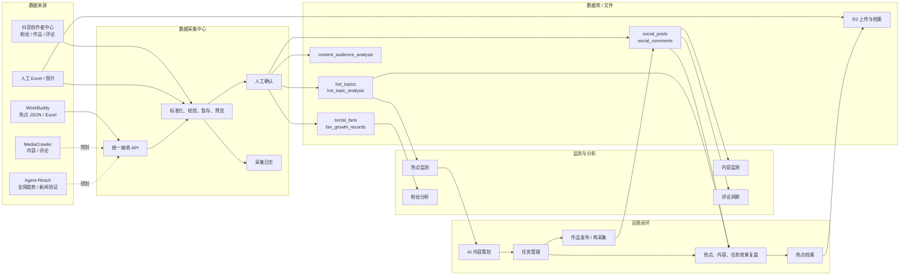
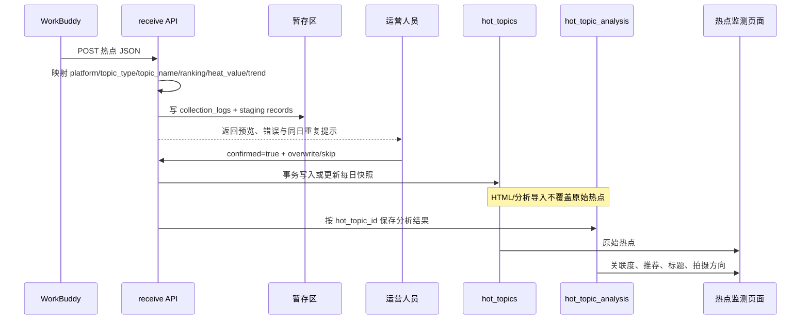
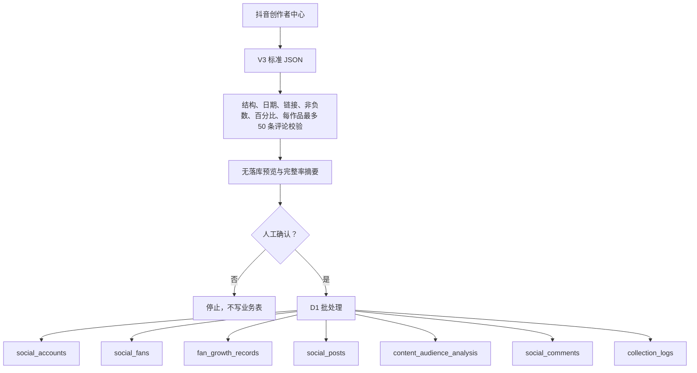
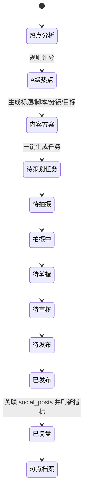

# 新媒体运营中心数据流

> 本文区分当前已运行链路与规划链路。实线表示代码中已有接收或业务处理，虚线表示尚未接入的未来能力。

## 1. 总流程

## 2. WorkBuddy 热点流

当前事实：

- 统一主链目标表是 `hot_topics`；`HOT_TOPIC_DATA` 是兼容的外部 Agent 原始/分析表。
- 同日同平台同来源重复数据在确认时要求显式选择覆盖或跳过。
- 热点分析独立存入 `hot_topic_analysis`，不会覆盖原始热点字段。

## 3. 抖音内容与粉丝流

说明：主系统代码接收和验证采集结果，不保证在云端直接控制本机抖音 App。账号登录、平台权限和源数据取得属于采集执行环境责任。

## 4. 内容策划与任务闭环

任务看板支持拖拽变更八阶段状态。作品关联后，系统读取播放、点赞、评论、收藏和分享，刷新内容方案与热点推荐效果。

## 5. 日期与平台口径

- 业务页面通过统一日期范围工具处理今日、昨日、近一周、自然月和自定义范围。
- 内容、评论一般按作品 `publish_time` 过滤；热点按 `collect_time` / `collection_date` 过滤；粉丝增长按 `record_date` 过滤。
- 当前业务平台枚举为 `douyin`、`kuaishou`、`weibo`；页面显示为抖音、快手、微博。
- 时间字符串写入前应携带明确时区；日归档按 Asia/Shanghai 口径生成。

## 6. 失败与恢复路径

1. 接收格式错误：返回 4xx，不创建业务数据。
2. 字段校验失败：批次状态为 `validation_failed`，禁止确认。
3. 同日热点重复：确认前必须选择 `overwrite` 或 `skip`。
4. D1 批处理失败：返回错误，不保留部分业务写入；采集日志记录失败信息。
5. 外部采集缺字段：保留失败原因，不能用模拟值伪造正式数据。
6. 档案文件缺失：下载接口可按指定日期重新生成；仍无数据时返回 404。

## 7. 未来接入边界

MediaCrawler 和 Agent-Reach 应作为独立进程运行，只通过统一 API 提交标准数据；不要把第三方采集器依赖、Cookie 或登录态放进主 Web 应用。接入前需完成平台条款、账号授权、限频、隐私和数据留存评估。
