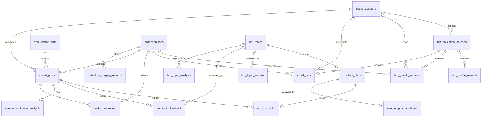

# 新媒体运营中心数据库设计

> 核对基线：`apps/social-media-center/db/schema.ts` 与 `db/bootstrap.ts`，2026-08-20。
> 数据库：Cloudflare D1（SQLite 语义）；JSON/数组字段以 `TEXT` 存储序列化 JSON。
> 本文只记录现有结构，不代表本次文档工作修改了数据库。

## 1. 关系总览

## 2. 账号、作品、评论与粉丝

### 2.1 `social_accounts`

用途：保存景区在各平台的账号主数据，是作品、粉丝快照和增长记录的父表。

| 字段 | 类型 | 作用 |
|---|---|---|
| `id` | INTEGER PK | 内部账号编号 |
| `platform` | TEXT | 平台代码：`douyin` / `kuaishou` / `weibo` |
| `account_name` | TEXT | 账号显示名称 |
| `account_id` | TEXT | 平台账号唯一标识 |
| `account_url` | TEXT NULL | 账号主页地址 |
| `followers_count` | INTEGER | 当前粉丝数缓存 |
| `following_count` | INTEGER | 关注数 |
| `likes_count` | INTEGER | 账号累计获赞 |
| `status` | TEXT | 账号状态，默认 `active` |
| `created_at` / `updated_at` | TEXT | 创建和更新时间 |

约束：`platform + account_id` 唯一。来源包括初始化、抖音确认入库和人工维护。主要供驾驶舱、内容监测和粉丝分析使用。

### 2.2 `social_posts`

用途：统一保存作品基础指标和抖音流量指标，是内容分析、任务关联与效果复盘的核心事实表。

| 字段 | 类型 | 作用 |
|---|---|---|
| `id` | INTEGER PK | 作品编号 |
| `account_id` | INTEGER FK | 关联 `social_accounts.id` |
| `platform` / `source` | TEXT | 平台与数据来源 |
| `title` / `content_type` | TEXT | 标题与内容类型 |
| `publish_time` | TEXT | 平台发布时间 |
| `video_url` / `cover_url` | TEXT NULL | 作品和封面地址 |
| `views` | INTEGER | 播放量 |
| `likes` / `comments` | INTEGER | 点赞量、平台显示评论量 |
| `favorites` / `shares` | INTEGER | 收藏量、分享量 |
| `fans_growth` | INTEGER | 作品级涨粉字段；是否可归因取决于来源口径 |
| `hashtags` | TEXT(JSON) | 标签数组 |
| `duration` | INTEGER NULL | 时长 |
| `completion_rate` / `skip_rate` | REAL NULL | 完播率、划走率 |
| `average_play_duration` | REAL NULL | 平均播放时长 |
| `traffic_sources` | TEXT(JSON) | 流量来源分布；当前页面不强制展示 |
| `ai_analysis` | TEXT(JSON) NULL | 作品分析扩展结果 |
| `import_log_id` | INTEGER FK NULL | Excel/图片导入日志 |
| `collection_log_id` | INTEGER FK NULL | 自动/API 采集日志 |
| `created_at` / `updated_at` | TEXT | 创建和更新时间 |

约束：`account_id + title` 唯一。来源包括抖音 V3、统一内容接口和 Excel 导入。主要供驾驶舱、内容监测、粉丝分析、AI 分析、策划、任务和复盘使用。

### 2.3 `social_comments`

用途：保存作品评论原文及规则分析结果。

| 字段 | 类型 | 作用 |
|---|---|---|
| `id` | INTEGER PK | 评论编号 |
| `post_id` | INTEGER FK | 关联 `social_posts.id`，作品删除时级联 |
| `platform` / `source` | TEXT | 平台与来源 |
| `username` | TEXT | 评论用户显示名 |
| `comment_text` | TEXT | 评论正文 |
| `comment_time` | TEXT | 评论时间 |
| `likes` | INTEGER | 评论点赞数 |
| `sentiment` | TEXT | 情绪标签，初始可为 `unknown` |
| `keyword` | TEXT NULL | 提取关键词 |
| `user_need` | TEXT NULL | 游客需求分类 |
| `ai_analysis` | TEXT(JSON) NULL | 引擎、置信度、规则命中等分析详情 |
| `ai_reply` | TEXT NULL | 回复建议 |
| `collection_log_id` | INTEGER FK NULL | 采集批次 |
| `created_at` | TEXT | 入库时间 |

来源：抖音评论确认或统一评论接口。主要供游客评论洞察、内容监测和作品详情使用。平台显示评论数在 `social_posts.comments`，已采集评论明细数需对本表计数，两者不一定相等。

### 2.4 `content_audience_analysis`

用途：保存单个作品的观众画像。

| 字段 | 类型 | 作用 |
|---|---|---|
| `id` | INTEGER PK | 分析编号 |
| `post_id` | INTEGER FK UNIQUE | 每个作品一条当前画像 |
| `platform` | TEXT | 平台 |
| `gender_distribution` | TEXT(JSON) | 性别分布 |
| `age_distribution` | TEXT(JSON) | 年龄分布 |
| `region_distribution` | TEXT(JSON) | 地域分布 |
| `source_type` / `source_record_id` | TEXT | 来源类型与来源记录标识 |
| `raw_payload` | TEXT(JSON) NULL | 原始数据留存 |
| `collection_log_id` | INTEGER FK NULL | 采集批次 |
| `collected_at` | TEXT | 源数据采集时间 |
| `created_at` / `updated_at` | TEXT | 创建和更新时间 |

来源：抖音 V3 作品详情。主要供作品详情观众分析使用。

### 2.5 `social_fans`

用途：保存账号级粉丝快照。V2.0 后画像明细不再写入本表 JSON 字段；旧字段仅为历史兼容。

| 字段 | 类型 | 作用 |
|---|---|---|
| `id` | INTEGER PK | 快照编号 |
| `account_id` | INTEGER FK | 关联账号 |
| `platform` | TEXT | 平台 |
| `account_name` / `snapshot_date` | TEXT | 快照账号名称和日期 |
| `fans_count` | INTEGER | 快照时粉丝总量 |
| `display_fans_count` | TEXT NULL | 平台缩写展示值，不覆盖精确粉丝数 |
| `male_ratio` / `female_ratio` | REAL NULL | 账号快照的性别比例 |
| `collection_time` / `data_period` | TEXT | 采集时间和原始周期集合 |
| `gender_distribution` 等旧字段 | TEXT(JSON) | V1历史兼容；V2新画像写入明细表 |
| `source_type` / `source_record_id` | TEXT | 来源类型和外部唯一标识 |
| `raw_payload` | TEXT(JSON) NULL | 原始快照 |
| `batch_id` | INTEGER FK NULL | 关联粉丝采集批次 |
| `collection_log_id` | INTEGER FK NULL | 采集批次 |
| `collected_at` / `created_at` | TEXT | 采集与入库时间 |

来源：抖音创作者中心真实采集、V3、API 或人工数据。主要供粉丝分析、运营驾驶舱使用。

### 2.6 `fan_growth_records`

用途：保存 daily、7d、30d、natural_month、custom 五类真实增长记录；区间汇总不会伪装成每日趋势。

| 字段 | 类型 | 作用 |
|---|---|---|
| `id` | INTEGER PK | 记录编号 |
| `account_id` | INTEGER FK | 关联账号 |
| `platform` | TEXT | 平台 |
| `record_date` | TEXT | V1兼容日期，V2查询以 `period_end` 为准 |
| `batch_id` / `snapshot_date` | INTEGER FK / TEXT | 采集批次和账号快照日期 |
| `period_type` | TEXT | `daily` / `7d` / `30d` / `natural_month` / `custom` |
| `period_start` / `period_end` | TEXT NULL | 平台实际提供的统计起止日期 |
| `fans_count` | INTEGER | 本次采集的精确账号粉丝数 |
| `net_growth` | INTEGER | 净增，可为负 |
| `new_fans` / `lost_fans` | INTEGER | V1兼容字段 |
| `new_followers` / `lost_followers` | INTEGER NULL | V2吸粉与脱粉 |
| `returning_followers` | INTEGER NULL | 回访粉丝量 |
| `collection_time` | TEXT NULL | 实际采集时间 |
| `source_type` / `source_record_id` | TEXT | 来源与外部标识 |
| `raw_payload` | TEXT(JSON) NULL | 原始记录 |
| `collection_log_id` | INTEGER FK NULL | 采集批次 |
| `created_at` / `updated_at` | TEXT | 创建和更新时间 |

约束：同一非空 `batch_id + period_type` 唯一。粉丝中心只用 `daily` 记录绘制折线，周期卡读取完全匹配的区间记录。

### 2.7 `fan_collection_batches`

用途：记录每次粉丝采集批次，按 `platform + account_id + source_file` 防止同一文件重复入库。

| 字段 | 类型 | 作用 |
|---|---|---|
| `batch_id` | INTEGER PK | 批次编号 |
| `platform` / `account_id` | TEXT / INTEGER FK | 平台和账号 |
| `collection_date` / `source_file` | TEXT | 采集日期和来源文件 |
| `data_period` | TEXT(JSON) NULL | 本批次包含的真实周期 |
| `raw_metric_count` / `success_metric_count` | INTEGER | 原始与成功指标数 |
| `unavailable_metric_count` | INTEGER | 平台未提供的指标数 |
| `status` / `created_at` | TEXT | pending、completed、failed及创建时间 |

### 2.8 `fan_profile_records`

用途：以通用维度明细保存历史画像，每次采集新增记录，不覆盖旧快照。

| 字段 | 类型 | 作用 |
|---|---|---|
| `id` / `batch_id` | INTEGER PK / FK | 明细和采集批次 |
| `platform` / `account_id` / `snapshot_date` | TEXT / FK / TEXT | 平台、账号、快照日期 |
| `dimension_type` | TEXT | gender、age、region、interest、device、activity、follow_keyword、other |
| `dimension_name` | TEXT | 平台原始维度名称 |
| `dimension_value` / `percentage` | REAL NULL | 原始数值和百分比；不可用时为 NULL |
| `ranking` / `raw_value` | INTEGER / TEXT NULL | 平台顺序和原始显示值 |
| `collection_time` / `created_at` | TEXT | 采集与入库时间 |

缺失字段以 `dimension_type=other`、数值 NULL、`raw_value` 以 `unavailable` 开头保存，不转换为0。

## 3. 采集、暂存与导入日志

### 3.1 `collection_logs`

用途：记录每次 Chrome、Excel 或 API 数据采集/接收批次。

| 字段 | 类型 | 作用 |
|---|---|---|
| `id` | INTEGER PK | 批次编号 |
| `platform` | TEXT | 平台 |
| `source_type` | TEXT | `chrome` / `excel` / `api` |
| `source_name` / `source_url` | TEXT | 来源名称和可选地址 |
| `entity_type` | TEXT | 数据类型，如 post、comment、hot_topic |
| `status` | TEXT | 待确认、校验失败、已完成或失败等状态 |
| `total_count` / `success_count` / `error_count` | INTEGER | 总数、成功数、错误数 |
| `comment_count` | INTEGER | 评论采集数 |
| `error_message` | TEXT NULL | 错误或重复跳过摘要 |
| `collected_at` | TEXT NULL | 源采集时间 |
| `created_at` / `updated_at` | TEXT | 日志时间 |

主要供数据采集中心、数据新鲜度提示和故障排查使用。

### 3.2 `collection_staging_records`

用途：统一 V2 API 的逐条暂存区，支持预览、人工确认和整批校验。

| 字段 | 类型 | 作用 |
|---|---|---|
| `id` | INTEGER PK | 暂存记录编号 |
| `collection_log_id` | INTEGER FK | 所属 `collection_logs`，删除批次时级联 |
| `record_index` | INTEGER | 源批次行号 |
| `data_type` | TEXT | `hot_topic` / `content` / `comment` |
| `platform` / `source` | TEXT | 标准平台与来源 |
| `normalized_payload` | TEXT(JSON) NULL | 标准化结果 |
| `raw_payload` | TEXT(JSON) | 原始记录 |
| `validation_status` | TEXT | `valid` / `invalid` |
| `validation_errors` | TEXT(JSON) | 错误列表 |
| `confirmed_at` | TEXT NULL | 人工确认时间 |
| `created_at` | TEXT | 暂存时间 |

约束：`collection_log_id + record_index` 唯一。该表不是业务事实表，确认后仍保留用于审计。

### 3.3 `data_import_logs`

用途：记录 Excel 与图片人工导入。

| 字段 | 类型 | 作用 |
|---|---|---|
| `id` | INTEGER PK | 导入编号 |
| `platform` | TEXT | 平台 |
| `file_name` | TEXT | 文件名 |
| `import_type` | TEXT | `excel` / `image` |
| `status` | TEXT | 导入状态 |
| `success_count` / `error_count` | INTEGER | 成功和错误数量 |
| `created_at` | TEXT | 导入时间 |

图片导入当前用于上传留档和人工确认，不代表已完成 OCR。

## 4. 热点、分析、复盘与档案

### 4.1 `hot_topics`

用途：标准化热点事实表，也是热点监测主数据源。

| 字段 | 类型 | 作用 |
|---|---|---|
| `id` | INTEGER PK | 热点编号 |
| `platform` | TEXT | 平台 |
| `topic_type` | TEXT | 热点榜、种草榜、挑战榜或内容热点等类型 |
| `data_source` / `source` | TEXT | 细分数据源与来源系统 |
| `topic_name` / `keyword` | TEXT | 热点名称和关键词 |
| `heat_value` / `ranking` | INTEGER | 热度与榜单排名 |
| `trend` / `category` | TEXT | 趋势与分类 |
| `related_degree` | INTEGER | 兼容的景区关联度字段 |
| `ai_suggestion` | TEXT NULL | 兼容的建议文本 |
| `status` | TEXT | 启用状态 |
| `source_url` / `source_record_id` | TEXT NULL | 源链接与源记录标识 |
| `source_agent` | TEXT NULL | Agent 名称 |
| `hot_score` | INTEGER NULL | 兼容的热点评分 |
| `recommended_topic` / `video_direction` / `publish_time_suggestion` | TEXT NULL | 兼容的选题、方向和发布时间建议 |
| `raw_payload` | TEXT(JSON) NULL | 原始热点记录 |
| `collection_log_id` | INTEGER FK NULL | 采集批次 |
| `collect_time` / `collection_date` | TEXT | 精确采集时间与北京时间快照日期 |
| `created_at` | TEXT | 入库时间 |

约束：`platform + data_source + topic_name + collection_date` 唯一。主要供热点监测、内容策划、内容分析和档案使用。

### 4.2 `hot_topic_analysis`

用途：与原始热点分离保存 AI/规则分析结果。

| 字段 | 类型 | 作用 |
|---|---|---|
| `id` | INTEGER PK | 分析编号 |
| `hot_topic_id` | INTEGER FK | 关联 `hot_topics.id`，热点删除时级联 |
| `relevance_score` | INTEGER | 与独山子大峡谷关联度 0–100 |
| `recommend_follow` | INTEGER/BOOLEAN | 是否建议跟进 |
| `recommendation_reason` | TEXT | 推荐或不推荐理由 |
| `recommended_title` | TEXT | 推荐短视频标题 |
| `shooting_direction` | TEXT | 拍摄方向 |
| `live_theme` | TEXT | 直播主题 |
| `analysis_source` | TEXT | 分析来源/版本 |
| `created_at` | TEXT | 分析时间 |

约束：`hot_topic_id + analysis_source` 唯一。热点页面按热点 ID 读取最新分析，不覆盖 `hot_topics` 原始数据。

### 4.3 `hot_topic_feedback`

用途：关联热点推荐与已发布作品，沉淀效果复盘。

| 字段 | 类型 | 作用 |
|---|---|---|
| `id` | INTEGER PK | 复盘编号 |
| `hot_topic_id` | INTEGER FK | 来源热点 |
| `recommended_at` | TEXT | 推荐时间 |
| `recommended_content` | TEXT(JSON) | 标题、方向、脚本和直播主题 |
| `social_post_id` / `related_post_id` | INTEGER FK NULL | 兼容字段与当前关联作品 |
| `platform` / `publish_time` | TEXT | 平台和作品发布时间 |
| `views` / `likes` / `comments` / `favorites` / `shares` | INTEGER | 关联作品效果快照 |
| `effect_score` | INTEGER NULL | 效果评分 |
| `ai_summary` | TEXT NULL | 复盘结论 |
| `is_effective` | INTEGER/BOOLEAN NULL | 推荐是否有效 |
| `evaluated_at` | TEXT NULL | 评价时间 |
| `created_at` / `updated_at` | TEXT | 创建和更新时间 |

主要供热点效果复盘、内容监测热点关联和热点档案使用。

### 4.4 `hot_topic_archive`

用途：保存每日热点分析快照，避免历史展示依赖实时关联表变化。

| 字段 | 类型 | 作用 |
|---|---|---|
| `id` | INTEGER PK | 档案编号 |
| `archive_date` | TEXT | 档案日期 |
| `hot_topic_id` | INTEGER FK | 原热点 |
| `topic_name` / `platform` / `topic_type` | TEXT | 热点快照信息 |
| `heat_value` / `ai_score` | INTEGER | 热度与 AI 分数 |
| `recommendation_level` | TEXT | A / B / C |
| `recommended_title` / `content_direction` | TEXT NULL | 推荐标题和内容方向 |
| `related_post_id` | INTEGER FK NULL | 关联作品 |
| `effect_score` | INTEGER NULL | 复盘评分 |
| `generated_at` | TEXT | 档案生成时间 |

约束：`archive_date + hot_topic_id` 唯一。页面支持日期、平台、类型筛选，R2 保存对应 Excel。

### 4.5 `HOT_TOPIC_DATA`

用途：早期 AI Agent 数据接入兼容表，保存 WorkBuddy 原始热点及内嵌分析。

| 字段 | 类型 | 作用 |
|---|---|---|
| `id` | INTEGER PK | 记录编号 |
| `platform` / `rank` | TEXT / INTEGER | 平台与排名 |
| `topic_title` / `heat_value` / `keyword` | TEXT | 标题、原始热度文本和关键词 |
| `url` / `publish_time` / `category` | TEXT | 链接、时间和分类 |
| `source_agent` | TEXT | 固定或传入的 Agent 来源 |
| `ai_relevance_score` | INTEGER | 关联评分 |
| `ai_analysis` / `ai_recommendation` | TEXT(JSON) | 分析与推荐 |

当前业务主链应优先使用 `hot_topics + hot_topic_analysis`；该表保留兼容性，不应与标准表混为同一事实源。

## 5. 内容策划、任务与反馈

### 5.1 `content_plans`

用途：保存 A 级热点生成的内容方案。

| 字段 | 类型 | 作用 |
|---|---|---|
| `plan_id` | INTEGER PK | 方案编号 |
| `hot_topic_id` | INTEGER FK | 来源热点 |
| `task_id` / `related_post_id` | INTEGER FK NULL | 生成的任务和发布作品 |
| `platform` / `content_type` | TEXT | 平台与内容类型 |
| `title` | TEXT | 主标题 |
| `title_options` | TEXT(JSON) | 5 个候选标题 |
| `script` | TEXT | 视频脚本 |
| `shot_list` | TEXT(JSON) | 拍摄分镜 |
| `cover_text` | TEXT | 封面文案 |
| `hashtags` / `recommended_topics` | TEXT(JSON) | 标签与话题 |
| `background_music` | TEXT NULL | 背景音乐建议 |
| `publish_time` / `live_theme` | TEXT | 推荐发布时间和可选直播主题 |
| `target_views` | INTEGER | 目标播放量 |
| `target_interaction_rate` | REAL | 目标互动率 |
| `target_fans_growth` | INTEGER | 目标涨粉 |
| `status` | TEXT | 方案状态 |
| `created_time` / `updated_time` | TEXT | 创建和更新时间 |

约束：`hot_topic_id + platform` 唯一。当前生成接口仅支持抖音 A 级热点。

### 5.2 `content_plan_feedback`

用途：保存内容方案与作品的 7 日效果复盘。

| 字段 | 类型 | 作用 |
|---|---|---|
| `plan_id` | INTEGER PK/FK | 关联 `content_plans` |
| `post_id` | INTEGER FK UNIQUE | 关联作品 |
| `views` / `likes` / `comments` / `favorites` / `shares` | INTEGER | 作品效果快照 |
| `effect_score` | INTEGER | 方案效果评分 |
| `ai_summary` | TEXT | 是否达标、原因和后续建议 |
| `evaluated_at` | TEXT | 评价时间 |

### 5.3 `content_tasks`

用途：八阶段内容生产任务。

| 字段 | 类型 | 作用 |
|---|---|---|
| `id` | INTEGER PK | 任务编号 |
| `task_date` | TEXT | 截止日期 |
| `platform` / `task_title` / `content_type` | TEXT | 平台、任务名称、内容类型 |
| `responsible_person` | TEXT NULL | 负责人 |
| `collaborators` | TEXT(JSON) | 协助人列表 |
| `source_type` / `source_id` | TEXT / INTEGER NULL | 热点、AI 策划、人工、节日活动等来源 |
| `priority` | TEXT | 优先级 |
| `status` | TEXT | 八阶段状态 |
| `related_post_id` | INTEGER FK NULL | 发布后关联作品 |
| `review_result` | TEXT NULL | 审核/执行分析摘要 |
| `completed_at` | TEXT NULL | 完成时间 |
| `created_at` / `updated_at` | TEXT | 创建和更新时间 |

主要供任务看板、营销运营中心和内容策划使用。

## 6. 竞品与爆款资产表

### 6.1 `competitor_accounts`

字段：`id`、`platform`、`account_name`、`account_url`、`followers`、`industry`、`created_at`。用途是竞品账号目录；当前没有稳定外部采集闭环。

### 6.2 `competitor_posts`

字段：`id`、`platform`、`account_name`、`title`、`publish_time`、`views`、`likes`、`comments`、`favorites`、`shares`、`source_type`、`source_record_id`、`raw_payload`、`collection_log_id`、`created_at`、`updated_at`。用途是同行作品对比；来源预留 API/Excel/手工和采集日志。

### 6.3 `viral_videos`

字段：`id`、`platform`、`category`、`account_name`、`title`、`publish_time`、`video_url`、五项互动指标、`video_structure`、`title_pattern`、`first_three_seconds`、`shooting_method`、`interaction_method`、`comment_feedback`、`breakout_reason`、`replicable_elements`、`dushanzi_suggestion`、来源/原始数据/日志与时间字段。用途是沉淀旅游、景区、新疆旅游和自然风景爆款结构；当前属于基础数据结构，真实资产库仍待持续导入。

## 7. 删除与一致性规则

- 删除账号会级联粉丝快照和增长记录，但已有作品对账号使用 `RESTRICT`，避免误删事实数据。
- 删除作品会级联评论和观众分析；任务、热点反馈和策划关联需要先处理外键关系。
- 删除采集日志会级联暂存记录；业务表的 `collection_log_id` 一般设为 `NULL`，保留业务事实。
- 热点分析和反馈随热点删除级联；热点档案对热点使用限制删除，保护历史资产。
- 所有正式删除操作应先确认目标范围并备份；本次文档工作未执行任何删除或迁移。

## 8. 数据质量注意事项

1. `social_posts.comments` 是平台显示总量，`social_comments` 是实际采集明细，不能直接等同。
2. `fans_growth` 与同日净增只能作为内容吸粉信号，不能默认解释为严格因果。
3. 分布字段的 `value` 口径需由来源定义为百分比或人数，并在适配器中统一。
4. 热度值跨平台不可直接比较，平台内排序优先于跨平台绝对值。
5. `collect_time`、`publish_time`、`record_date` 与 `created_at` 用途不同，页面筛选必须使用业务时间字段。
6. `HOT_TOPIC_DATA` 与 `hot_topics` 并存时，页面和报表必须明确主数据源，防止重复统计。
