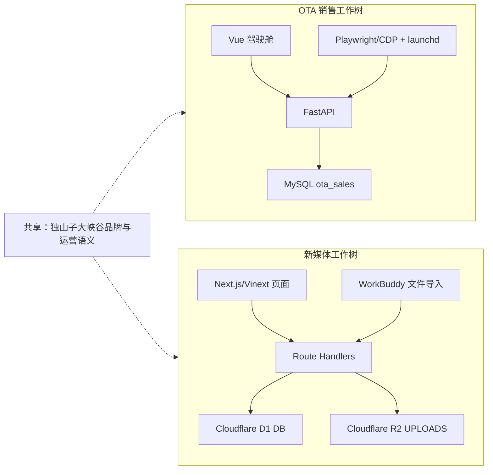

# 独山子大峡谷 AI 营销中台 GitHub 仓库管理评估与实施方案

> 评估日期：2026-08-17（Asia/Shanghai）  
> 本文档只记录当前状态和方案；本阶段未创建仓库、未移动或删除文件、未修改数据库、未修改 remote、未推送代码、未改写 Git 历史。

## 1. 当前 Git 状态

### 1.1 总体结论

当前不是一个包含 OTA 与新媒体的单一 Git 仓库。`/Users/akram/Documents` 不是 Git 根目录，其下已经存在两个相互独立的 Git 工作树：

| 系统 | Git 根目录 | 是否已初始化 | 当前分支 | remote | GitHub 地址 |
|---|---|---:|---|---|---|
| 新媒体运营中心 | `/Users/akram/Documents/新媒体运营` | 是 | `main` | 未配置 | 当前无 GitHub 仓库地址 |
| OTA 销售系统 | `/Users/akram/Documents/销售驾驶舱` | 是 | `main` | `origin` | `https://github.com/19990275025-lab/dushanzi-ai-marketing-os.git` |

### 1.2 新媒体运营中心 Git 状态

- HEAD：`0af0fe6 refactor: 统一使用侧边平台入口`
- 本地提交数：61
- upstream：未设置。
- 未推送 commit：因为没有配置 GitHub remote/upstream，无法计算“相对 GitHub 未推送数量”。换言之，当前全部本地历史都没有一个可由 Git 追踪的 GitHub 目标。
- 本地存在 `sites/main` 等 remote-tracking 形式的引用，但 `git remote -v` 为空；这些引用不等于已配置 GitHub remote。
- tag：无。
- 工作树：已跟踪文件在评估开始时无修改，但存在未跟踪项：根目录 `.github/`、`.gitignore`、`CONTRIBUTING.md`、`data/`、`templates/`、多个运营文档、`docs/data-collector-integration.md`，以及带有自己 `.git` 的 `Agent-Reach/` 和 `MediaCrawler/`。
- 额外 worktree：`/private/tmp/social-sites-main.hXahGO` 对应 `codex/sites-comment-backfill-20260808`，Git 标记为 `prunable`（路径已失效）。此项不影响当前 `main`，但在正式规范前应单独确认后再清理。
- 本文档生成后，`docs/github-repository-plan.md` 会成为本次评估唯一新增的交付文件。

#### 最近 20 条 commit

| Commit | 时间 | 说明 |
|---|---|---|
| `0af0fe6` | 2026-08-17 17:05 | `refactor: 统一使用侧边平台入口` |
| `0939f96` | 2026-08-17 16:52 | `feat: 支持平台菜单展开与关闭` |
| `a9f57b5` | 2026-08-17 16:39 | `feat: 新增内容与热点平台侧边筛选` |
| `57b65f4` | 2026-08-17 15:49 | `feat: 升级粉丝分析中心V2.0` |
| `f4e4531` | 2026-08-17 15:08 | `feat: 新增营销运营中心V1.0` |
| `31b683b` | 2026-08-16 19:05 | `feat: 升级任务管理中心V2.0` |
| `3ee66d5` | 2026-08-12 12:39 | `feat: 新增AI内容策划中心V1.0` |
| `fda690a` | 2026-08-11 20:19 | `feat: 新增内容监测中心V1.0` |
| `a01928a` | 2026-08-11 19:37 | `feat: 新增热点数据档案库V4.0` |
| `d543905` | 2026-08-11 18:46 | `feat: 新增热点推荐效果复盘V3.0` |
| `5895730` | 2026-08-11 17:43 | `feat: 新增热点推荐效果复盘V3.0` |
| `da8b2ea` | 2026-08-11 16:46 | `feat: 新增热点AI行动推荐中心V2.5` |
| `6ed40a6` | 2026-08-11 15:56 | `fix: 对齐WorkBuddy热点报告推荐口径` |
| `a4f75de` | 2026-08-11 15:53 | `feat: 新增热点原始数据与AI分析分表存储` |
| `2ae72f8` | 2026-08-11 15:10 | `feat: 更新WorkBuddy热点数据导入V2.0` |
| `eb8b485` | 2026-08-11 14:00 | `fix: 修复热点监测中心数据读取问题` |
| `d0634ed` | 2026-08-11 13:38 | `feat: 接入WorkBuddy热点数据源V1.0` |
| `722dd9c` | 2026-08-11 13:18 | `feat: 新增数据采集标准化接口V2.1` |
| `a234eff` | 2026-08-11 13:04 | `docs: 设计数据采集中心V2架构` |
| `e547b7b` | 2026-08-10 20:05 | `style: 优化热点分析报告可读性` |

### 1.3 OTA 销售系统 Git 状态

- HEAD：`c6abeef refactor: 移除营销经营联动模块`
- 本地提交数：10。
- upstream：`origin/main`。
- 远程校验：`git ls-remote` 显示 GitHub `main` 也是 `c6abeef`。
- 未推送 commit：0（本地 HEAD 与远程 `main` 一致）。
- tag：本地和 GitHub 远程均无。
- 未提交修改：4 个文件，共 64 行新增、21 行删除：
  - `backend/app/collectors/ctrip_collector.py`
  - `backend/app/collectors/meituan_collector.py`
  - `backend/tests/test_ctrip_collector.py`
  - `backend/tests/test_meituan_collector.py`

#### 最近 commit（仓库当前共 10 条）

| Commit | 时间 | 说明 |
|---|---|---|
| `c6abeef` | 2026-08-16 19:11 | `refactor: 移除营销经营联动模块` |
| `19d2752` | 2026-08-16 18:23 | `feat: OTA销售驾驶舱 V2.5 生产自动化稳定版` |
| `5994d51` | 2026-08-08 23:54 | `fix: 明确抖音直播商品券数采集口径` |
| `5f8724e` | 2026-08-08 23:48 | `feat: OTA销售驾驶舱 V2.2 抖音直播自动采集` |
| `9e8a2f0` | 2026-08-06 14:34 | `feat: OTA销售驾驶舱 V1.5 完成三平台数据标准化与产品映射` |
| `85a6287` | 2026-08-01 19:48 | `OTA销售驾驶舱 V1.4 携程自动采集` |
| `55ba24a` | 2026-08-01 17:41 | `OTA销售驾驶舱 V1.3.1 Chrome自动化连接优化` |
| `9b7559d` | 2026-08-01 17:05 | `OTA销售驾驶舱 V1.3 美团网页采集` |
| `93d28d0` | 2026-07-31 19:20 | `OTA销售驾驶舱 V1.2 自动报表导入` |
| `2a432c2` | 2026-07-31 18:52 | `OTA销售驾驶舱 V1.1 初始版本` |

## 2. 当前项目结构

### 2.1 OTA 销售系统

OTA 是一个完整、独立的前后端仓库：

```text
销售驾驶舱/
├── frontend/dashboard/       # Vue 3 + Vite 销售驾驶舱
├── backend/app/             # FastAPI + SQLAlchemy 后端
├── backend/tests/           # 后端测试
├── database/                # MySQL 基线 schema 与迁移
├── automation/              # 入箱、归档、日志、launchd 配置
├── scripts/                 # 采集、回补、导入、启动脚本
├── docs/                    # OTA 版本与功能文档
└── outputs/                 # 经营简报、报表和页面验收产物
```

技术核心：

- 前端：Vue 3、Vue Router、ECharts、Vite。
- 后端：FastAPI、SQLAlchemy、PyMySQL、Playwright、OpenPyXL、PDF/Word 导出。
- 数据库：MySQL，默认库名 `ota_sales`。
- 部署/运行：本地 Vue 前端 + FastAPI API，macOS `launchd` 执行每日自动化。

### 2.2 新媒体运营中心

新媒体也是一个完整、独立的应用仓库，主应用位于 `apps/social-media-center/`：

```text
新媒体运营/
├── apps/social-media-center/
│   ├── app/                  # Next.js/Vinext 页面与 API Route
│   ├── components/           # 应用壳、全局日期筛选等公共组件
│   ├── lib/                  # 采集、分析、策划、任务等业务逻辑
│   ├── db/                   # Drizzle D1 连接、schema 与启动校验
│   ├── drizzle/              # Cloudflare D1 迁移
│   ├── worker/               # Cloudflare Worker 与定时档案/复盘任务
│   ├── scripts/              # WorkBuddy 数据导入桥接
│   └── tests/                # 建构与架构回归测试
├── database/                    # 早期/根级新媒体数据库迁移与种子数据
├── docs/                        # 新媒体架构、数据库、采集评估文档
├── data/                        # 运营数据文件（当前部分未跟踪）
└── templates/                   # 运营模板（当前未跟踪）
```

技术核心：

- 前端与 API：Next.js 16 + React 19 + Vinext/Vite，页面和 Route Handler 在同一应用中。
- 数据库：Cloudflare D1（SQLite），Drizzle ORM，逻辑绑定名 `DB`。
- 文件存储：Cloudflare R2，逻辑绑定名 `UPLOADS`。
- 部署：Cloudflare Worker/Sites，与 OTA 本地 FastAPI 运行方式不同。

## 3. OTA 模块范围

| 业务范围 | 主要代码位置 | 说明 |
|---|---|---|
| OTA 销售驾驶舱 | `frontend/dashboard/src/views/HomeDashboard.vue`、`PlatformDashboard.vue`、`ProductAnalysis.vue` | 总览、平台分析、产品销售分析 |
| 美团采集 | `backend/app/collectors/meituan_collector.py`、`services/meituan_collection_service.py`、`scripts/collect-meituan.sh` | 美团门票度假商家中心采集 |
| 携程采集 | `backend/app/collectors/ctrip_collector.py`、`services/ctrip_collection_service.py`、`scripts/collect-ctrip.sh` | 携程 V Booking 数据参谋采集 |
| 抖音来客销售采集 | `backend/app/collectors/douyin_collector.py`、`services/douyin_collection_service.py`、`scripts/collect-douyin.sh` | 抖音来客生意经报表与销售数据 |
| 直播销售数据 | `douyin_live_collector.py`、`douyin_live_collection_service.py`、`LiveOperations.vue`、`scripts/collect-douyin-live.sh` | 直播场次、交易、核销、观众与商品数据 |
| OTA 经营简报 | `operating_brief_*_service.py`、`OperatingBrief.vue`、`outputs/operating-brief/` | 简报生成、存档及 PDF/Word/Excel 导出 |
| 智能报表中心 | `report_center_service.py`、`ReportCenter.vue` | 经营报表统一生成 |
| OTA 销售数据库 | `backend/app/models.py`、`database/schema.sql`、`database/migrations/` | `OTA_SALES_DATA`、产品映射、直播、目标、报表等 MySQL 表 |
| OTA 自动化 | `backend/app/automation/`、`automation/`、`scripts/` | Chrome/CDP、每日任务、历史回补、质量检查、钉钉通知 |

当前检查未发现一个独立的“OTA 舆情监测中心”源码目录；本文档的 OTA 边界以实际存在的销售、直播、报表、采集和自动化代码为准。

## 4. 新媒体模块范围

| 业务范围 | 页面/服务位置 | 主要数据 |
|---|---|---|
| 营销运营中心 | `app/marketing-operations/`、`lib/task-management.ts` | 热点、任务、发布计划和简报汇总 |
| 运营驾驶舱 | `app/page.tsx`、`app/api/dashboard/` | 账号、作品、互动、任务、热点 |
| 内容监测中心 | `app/insights/content/`、`app/api/content-monitoring/`、`lib/content-monitoring.ts` | `social_posts`、`social_comments`、热点复盘 |
| 粉丝分析中心 | `app/insights/fans/`、`app/api/insights/fans/`、`lib/fan-report-export.ts` | `social_fans`、`fan_growth_records` |
| 数据采集中心 | `app/collector/`、`app/imports/`、`app/api/collections/`、`app/api/data-collection/v2/` | 暂存、预览、确认、采集日志 |
| 热点监测中心 | `app/hot-topics/`、`app/hot-topic-archive/`、`app/api/hot-topic-*`、`lib/hot-topic-*` | `hot_topics`、`hot_topic_analysis`、`hot_topic_feedback`、档案 |
| AI 内容策划中心 | `app/content-planning/`、`app/api/content-planning/`、`lib/content-planning.ts` | `content_plans`、`content_plan_feedback` |
| AI 内容分析中心 | `app/ai-analysis/`、`app/api/ai-analysis/`、`lib/content-analysis-engine.ts` | 作品评分、报告和建议 |
| 游客评论洞察 | `app/comment-insights/`、`app/api/comment-insights/`、`lib/comment-insight-engine.ts` | `social_comments` 情绪、关键词、需求 |
| 任务管理中心 | `app/tasks/`、`app/api/tasks/`、`lib/task-management.ts` | `content_tasks`、方案、作品关联与复盘 |

`Agent-Reach/` 和 `MediaCrawler/` 是两个单独下载的上游 Git 仓库，分别保留自己的 `origin`，当前仅被新媒体评估文档引用；新媒体 `package.json`、源码 import 和 API 中都没有将它们作为运行时依赖。它们不应被误判为新媒体主应用源码的一部分。

## 5. 两个模块的共享依赖

### 5.1 依赖关系图



### 5.2 检查结果

| 依赖类型 | 是否共享 | 实际情况 |
|---|---:|---|
| 前端项目 | 否 | OTA 是 `frontend/dashboard` 中的 Vue/Vite；新媒体是 `apps/social-media-center` 中的 Next.js/React/Vinext。 |
| 后端服务 | 否 | OTA 是独立 FastAPI 进程；新媒体是同应用 Route Handler + Cloudflare Worker。 |
| 数据库 | 否 | OTA 使用 MySQL `ota_sales`；新媒体使用 Cloudflare D1 `DB`。未发现交叉表或跨库连接。 |
| 用户系统 | 否 | 两个代码库都未实现业务用户、角色或登录表。新媒体的 Sites 访问控制属于托管层，不是两系统共享用户系统。 |
| API | 否 | OTA 前端调用自己的 FastAPI `/api`；新媒体页面调用自己的 `/api/*` Route Handler。未发现相互 HTTP 调用。 |
| 组件 | 否 | OTA 使用 Vue 组件；新媒体使用 React 组件，无可直接共享的组件包。 |
| 环境变量 | 否 | OTA 使用 `DATABASE_URL`、平台 CDP URL、钉钉等后端环境变量；新媒体使用 D1/R2 绑定和 `WORKBUDDY_*`。配置文件不共享。 |
| 自动化目录 | 否 | OTA 使用仓库内 `automation/`、`scripts/` 和 `launchd`；新媒体只有应用内 WorkBuddy 导入脚本和 Worker cron。 |
| 公共工具函数 | 否 | 两个 Git 根目录之间没有跨目录 import、符号链接或共享 package。 |
| 本机资源 | 弱共享 | 两者运行在同一台 Mac，业务上都涉及抖音，但目前代码未共享 Chrome 适配器或采集队列。 |
| 品牌/业务口径 | 是 | 共享“独山子大峡谷 AI 营销中台”品牌、平台名称和日期/运营概念，但这是语义共享，不是运行时依赖。 |

结论：两个系统当前可独立建构、独立测试、独立运行、独立发布、独立迁移数据库。不存在为了保持当前功能而必须同仓的代码依赖。

## 6. 是否适合拆仓库

### 方案 A：两个独立 GitHub 仓库

**适合度：高，推荐。**

实际代码已经满足独立仓库的核心条件：

1. 已经是两个独立 Git 工作树，无需拆分任何现有代码。
2. 前端框架、后端框架、数据库、部署方式和自动化模型全部不同。
3. 无跨工作树 import、无共享 package、无跨库外键、无相互 API 调用。
4. OTA 已有自己的 GitHub 历史；新媒体已有 61 条独立本地历史，只需在确认后连接自己的 GitHub 仓库。
5. 两个系统发布节奏不同：OTA 需本地采集、MySQL 和 launchd；新媒体需 Cloudflare D1/R2/Sites。分开后的 CI/CD 边界更清晰。

建议仓库名：

- `dushanzi-ota-center`
- `dushanzi-social-center`

OTA 当前 GitHub 名称为 `dushanzi-ai-marketing-os`。正式实施时可二选一：在 GitHub 上安全重命名现有仓库（GitHub 通常保留重定向），或先添加新 remote、完整推送分支与 tag 并验证后再切换。本阶段不执行任何一种。

### 方案 B：保留一个 AI 营销中台总仓库

**适合度：低，当前不推荐。**

要实现 `/modules/ota` 和 `/modules/social-media`，反而需要：

- 新建第三个总仓库或把一方历史并入另一方；
- 移动两个现有目录，修改 OTA `launchd` 里已写死的 `/Users/akram/Documents/销售驾驶舱` 路径；
- 同时管理 Python/FastAPI/MySQL 和 Node/Next.js/D1/R2 的异构 CI；
- 处理两套历史合并、权限、发布和 tag 过滤；
- 解决顶层 `.gitignore`、产物目录和嵌套外部仓库的边界。

这些成本并不会换来实际代码复用，反而会制造当前不存在的耦合。如果未来真正出现共享身份系统、统一 API Gateway 或可复用数据契约，可以另建轻量“中台集成仓库”，而不是把两个业务应用强行合并。

## 7. 推荐方案

推荐采用 **方案 A：两个独立 GitHub 仓库**。

推荐的最终边界：

| 仓库 | 保留的当前工作树 | 主要发布物 | 版本 tag |
|---|---|---|---|
| `dushanzi-ota-center` | `/Users/akram/Documents/销售驾驶舱` | Vue 驾驶舱、FastAPI、MySQL 迁移、采集与 launchd | `ota-v1.0.0`、`ota-v1.1.0` |
| `dushanzi-social-center` | `/Users/akram/Documents/新媒体运营` | Next.js/Vinext 应用、D1 迁移、R2、WorkBuddy 接入 | `social-v1.0.0`、`social-v1.1.0` |

即使两个仓库已经独立，仍建议保留模块前缀 tag，便于备份、导出和跨系统发布日历中快速识别。

提交信息规范：

```text
feat(ota): 修复携程销售采集
fix(ota): 修正美团订单口径
docs(ota): 更新OTA经营简报说明

feat(social): 新增粉丝分析中心
fix(social): 修复热点平台筛选
docs(social): 更新数据采集接入说明
```

类型建议限定为 `feat`、`fix`、`refactor`、`docs`、`test`、`build`、`chore`、`revert`；scope 在两个主仓库中固定使用 `ota` 或 `social`。

## 8. 实施步骤（待确认后执行）

### 阶段 0：冻结与备份

1. 暂停两个工作树的并行开发。
2. 分别导出 `git bundle --all` 本地备份，并记录 HEAD SHA。
3. 不处理数据库数据，只备份 Git 历史和必要配置模板。

### 阶段 1：清点当前改动

1. OTA：由开发者确认 4 个 collector/test 修改是否组成一个完整提交；不应在改 remote 时夹带未确认改动。
2. 新媒体：逐项确认未跟踪文件是“应入库”、“应忽略”还是“外部仓库”。
3. `Agent-Reach/` 和 `MediaCrawler/` 默认不纳入新媒体主仓库；如果未来需要锁定版本，再单独评估 submodule/subtree，不直接嵌套提交。
4. 确认新媒体根级 `.gitignore` 要保留的规则，避免凭据、素材和大文件误入 Git。
5. 确认后处理失效 worktree 引用；本次不清理。

### 阶段 2：建立独立 GitHub 边界

1. OTA：优先保留现有完整历史。若采用新仓库，先将其作为新 remote 添加，推送 `main` 和全部 tag，核对后再决定是否替换 `origin`。
2. 新媒体：创建空的 `dushanzi-social-center`，将当前工作树的本地历史原样推送，不 squash、不 rebase、不改写历史。
3. 核对 GitHub 默认分支、分支保护、仓库权限和私有性。
4. 两个仓库都启用 PR 审核，禁止保护分支 force push。

### 阶段 3：独立版本和发布

1. 从已验收的稳定 commit 创建第一个 tag，不根据文档名盲目追溯打 tag。
2. OTA 使用 `ota-vMAJOR.MINOR.PATCH`；新媒体使用 `social-vMAJOR.MINOR.PATCH`。
3. 建立独立 `CHANGELOG.md` 或 GitHub Release Notes。
4. 解决现有版本号漂移：OTA 前端 `package.json=1.0.0`、FastAPI `version=2.1.1`、文档/提交已到 V2.5；新媒体 `package.json=0.1.0`、业务模块却有 V1–V4。正式 tag 前必须指定每个仓库的唯一版本源。
5. tag 必须使用 annotated tag，并在测试通过后创建。

### 阶段 4：独立 CI/CD

1. OTA CI：Python 测试 + Vue 构建 + MySQL 迁移静态检查；发布文档包含本地自动化安装步骤。
2. 新媒体 CI：Node 锁文件安装 + lint/test/build + D1 迁移检查；Sites 部署保留独立凭据与发布流程。
3. 两个仓库的 secrets、环境保护规则和发布审批不共享。

## 9. 回滚方案

### 9.1 仓库连接回滚

- 实施前保留两个工作树的 `git bundle --all` 和 HEAD SHA。
- OTA 迁移时先“添加新 remote”，不立即删除原 `origin`。若新仓库验证失败，继续使用 `dushanzi-ai-marketing-os` 即可。
- 新媒体当前无 remote，其本地 `.git` 是历史源。新 GitHub 仓库连接失败时，删除新增 remote 配置即可，本地历史不受影响。
- 全过程不使用 `push --force`、`filter-repo`、`rebase --root` 或 `reset --hard`。

### 9.2 版本回滚

- 发布时记录 tag 对应 commit、数据库迁移版本和部署编号。
- 代码回滚使用 `git revert`生成新 commit，不删除历史。
- 数据库回滚不与 Git tag 自动绑定执行；必须根据 MySQL 或 D1 的独立迁移方案操作。
- 新媒体 Sites 发布保留已验证版本；OTA 本地自动化保留上一个安装配置和启动脚本。

## 10. 风险点

| 级别 | 风险 | 影响 | 建议控制 |
|---|---|---|---|
| 高 | OTA 当前有 4 个未提交 collector/test 修改 | 切换 remote 时可能遗漏或夹带未完成工作 | 先由开发者审核、测试并单独提交或安全保留 |
| 高 | 新媒体没有 GitHub remote/upstream | 本地硬盘是 61 条历史的主要保存点 | 先做 `git bundle --all` 备份，再连接新 GitHub 仓库 |
| 高 | 新媒体有大量未跟踪文件，包括未跟踪的根 `.gitignore` | 可能遗漏有效运营文档，也可能误提交素材、凭据或外部仓库 | 逐项分类，不使用 `git add .` 批量纳入 |
| 高 | `Agent-Reach/` 与 `MediaCrawler/` 是嵌套独立 Git 仓库 | 可能被误提交为 gitlink、嵌套工作树或巨量源码 | 默认保持外部依赖身份，正式评估后再决定 ignore/submodule |
| 高 | OTA `launchd` 文件写死当前绝对路径 | 如为了 monorepo 移动目录，定时采集和报告会直接失效 | 采用独立仓库方案并保留当前本地路径 |
| 中 | 两仓库都没有正式 tag | 无法精确追溯已发布版本 | 从验收过的 commit 开始建立 `ota-v*` / `social-v*` annotated tag |
| 中 | 应用内版本号与文档版本不一致 | 发布说明和故障定位容易混乱 | 各仓库建立唯一版本源和发布检查 |
| 中 | 新媒体存在失效的额外 worktree 记录 | 后续分支或 worktree 管理可能出现混淆 | 确认无需恢复后再使用标准 Git 流程清理 |
| 中 | 两系统都使用“抖音”语义，但数据口径不同 | 容易把抖音来客销售、直播销售与新媒体作品/粉丝数据混同 | 继续分库、分 API、分 scope；未来交换数据时使用明确契约 |
| 低 | 独立仓库会产生两套 Issue/Release/CI | 管理入口增加 | 使用统一组织、命名规则、Project 看板和发布日历汇总 |

## 待确认决策

建议确认以下决策后再开始任何仓库操作：

1. 确认采用方案 A。
2. 确认 OTA 是重命名现有 GitHub 仓库，还是先创建新仓库再验证迁移。
3. 确认新媒体未跟踪文件、运营资料和两个外部采集工具的归属。
4. 确认 OTA 当前 4 个未提交修改的处理方式。
5. 确认两个仓库的首个正式 tag 对应哪个已验收 commit。

本文档完成后应停止执行，等待业务负责人确认仓库方案。
