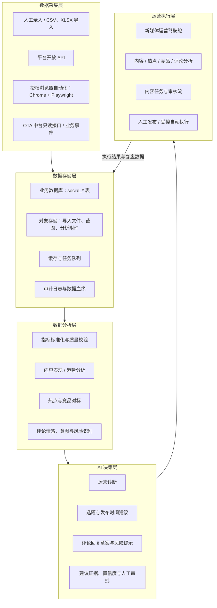
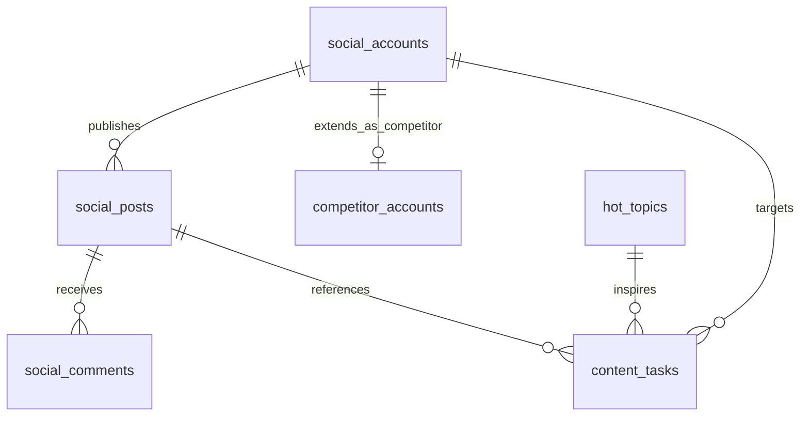
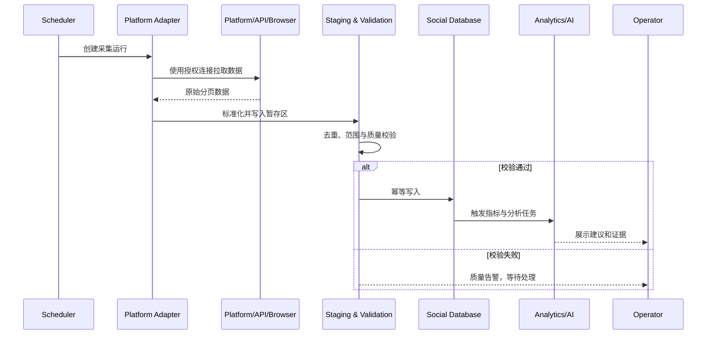

# 独山子大峡谷 AI 营销中台——新媒体运营中心 V1.0 架构设计

> 文档状态：待评审  
> 版本：V1.0  
> 编制日期：2026-08-07  
> 本阶段范围：系统架构与接口规划，不包含代码实现

## 0. 设计摘要

新媒体运营中心是“独山子大峡谷 AI 营销中台”的内容增长与用户反馈中枢，面向抖音、快手、微博三个平台，统一管理账号、作品、热点、竞品、评论、AI 建议与内容任务。

本设计遵循三个边界：

1. 不修改“OTA 销售驾驶舱”和“OTA 舆情监测中心”的现有功能、路由、数据表与接口。
2. 新模块使用独立命名空间、独立数据表和适配器接入方式；与 OTA 模块只通过稳定接口或事件进行可控的数据交换。
3. V1.0 先建立可人工录入、可审计、可扩展的基础架构；自动采集和自动运营按阶段开放，避免把平台账号安全、数据合规和 AI 自动执行风险带入首期。

## 1. 当前项目结构分析

### 1.1 检查范围与结论

本次检查对象为当前工作区 `/Users/akram/Documents/新媒体运营`。截至 2026-08-07，仓库内容是以 Markdown、CSV 和 GitHub 模板组成的运营协作基线，并非 AI 营销中台应用源码。

| 检查项 | 当前工作区核实结果 | 对本次设计的影响 |
|---|---|---|
| 前端技术架构 | 未发现 `package.json`、前端源码目录、构建配置或组件库配置，无法确认 React、Vue 或其他框架 | 文档只定义前端模块边界、页面与契约，不指定对现有前端进行改造；实施前需在实际中台源码仓库完成技术栈复核 |
| 后端技术架构 | 未发现后端源码、依赖清单、服务配置或 API 定义，无法确认语言、框架与部署方式 | API 使用技术中立的 REST 规划；落地时适配实际后端框架 |
| 数据库结构 | 未发现迁移文件、ORM Schema、DDL 或数据库连接配置 | 本文给出逻辑数据模型与推荐 PostgreSQL 类型；实施前需对实际数据库方言、主键规范和租户模型做映射 |
| 当前模块目录 | 已有 `docs/`、`templates/`、`data/`、`.github/`；未发现 OTA 销售驾驶舱或 OTA 舆情监测中心源码目录 | 两个 OTA 模块按用户确认视为外部既有模块；本阶段不触碰，后续只通过集成契约连接 |
| Git/GitHub | 本地分支为 `main`，尚无提交；全部现有文件均为未跟踪文件；未配置远端地址 | 可对新增设计文档单独创建本地提交，但在配置 GitHub remote 前无法推送到 GitHub |

### 1.2 当前目录基线

```text
新媒体运营/
├── .github/
│   ├── ISSUE_TEMPLATE/
│   └── PULL_REQUEST_TEMPLATE.md
├── data/
│   └── 内容排期表.csv
├── docs/
│   ├── 00-运营中心章程.md
│   ├── 01-品牌与受众.md
│   ├── 02-账号矩阵.md
│   ├── 03-内容生产SOP.md
│   ├── 04-首月内容计划.md
│   ├── 05-KPI与数据看板.md
│   ├── 06-舆情与危机响应.md
│   └── 07-组织与岗位.md
├── templates/
│   ├── 内容简报.md
│   └── 发布检查表.md
├── CONTRIBUTING.md
└── README.md
```

现有运营文档中与新模块直接相关的业务口径包括：

- 北极星指标：可归因的有效到访意向数；未打通交易前使用“高意向行为数”作为代理指标。
- 内容复盘节奏：发布后 24 小时首报、7 天完整复盘。
- 风险处置：P0–P3 四级舆情响应机制。
- 内容流程：选题、核验、采集、制作、审核、发布、互动、复盘。
- 内容编号：`DSZ-YYYYMMDD-平台-序号`。

### 1.3 实施前技术复核门禁

由于当前工作区不包含实际中台源码，进入开发前必须在真实应用仓库补充完成以下只读核查，并将结论写入技术决策记录（ADR）：

1. 前端框架、路由、状态管理、组件库、鉴权方式和图表库。
2. 后端语言、服务边界、API 风格、任务队列、缓存和对象存储。
3. 数据库类型、版本、主键策略、时区、租户隔离、迁移工具和备份策略。
4. OTA 两个模块的目录、路由、表前缀、接口依赖和发布流水线。
5. GitHub remote、默认分支、分支保护、CI、代码所有者与发布流程。

复核完成前，不应创建数据库迁移或修改 OTA 模块代码。

## 2. 模块定位

### 2.1 在 AI 营销中台中的作用

新媒体运营中心承接“内容生产—传播反馈—运营决策—任务执行”闭环：

- 向上汇总四个平台的账号、内容与用户反馈，形成统一经营视图。
- 横向连接热点和竞品数据，为选题策划提供外部信号。
- 通过指标计算、评论语义分析和 AI 建议，将数据转化为可执行的内容任务。
- 向下沉淀审核记录、执行状态和复盘结论，形成可追踪的运营知识。
- 在未来通过受控接口向 OTA 销售驾驶舱提供内容归因线索，接收可公开的产品和活动信息；不直接读写 OTA 核心业务表。

### 2.2 用户与职责

| 角色 | 核心能力 | 数据权限建议 |
|---|---|---|
| 运营负责人 | 查看全局数据、审批任务、采纳 AI 建议、查看竞品 | 全模块读写，敏感配置除外 |
| 内容策划/编辑 | 查看热点和内容表现、创建与推进任务 | 内容、热点、任务读写 |
| 社群/客服 | 评论分类、回复建议、风险上报 | 评论读写，其他模块只读 |
| 数据分析 | 指标配置、数据校验、分析报告 | 数据与分析读写，不具备发布权限 |
| 管理层 | 驾驶舱与报告 | 聚合数据只读 |
| 系统管理员 | 账号连接、采集任务、权限和审计 | 配置权限，不默认拥有内容发布权 |

### 2.3 功能边界

V1.0 包含：

- 抖音、快手、微博的账号台账。
- 作品与每日/阶段表现数据管理。
- 热点、竞品、评论、AI 建议与内容任务的查询和协作框架。
- 手工录入和标准文件导入的接口预留。

V1.0 不包含：

- 未经授权的账号登录、绕过验证码、批量私信或自动发布。
- 对平台规则禁止的数据抓取。
- OTA 订单、库存、票价等核心数据的直接写入。
- AI 在无人审批的情况下对外回复、删除评论或发布内容。

## 3. 总体系统架构



### 3.1 建议逻辑组件

| 组件 | 职责 | 隔离要求 |
|---|---|---|
| Social Center Web | 页面、筛选、报表、任务协作 | 使用 `/social-media/*` 独立路由，不改写 OTA 页面 |
| Social API | 账号、作品、评论、热点、竞品、任务的业务接口 | 使用 `/api/v1/social/*` 命名空间 |
| Ingestion Service | 文件导入、API 拉取、浏览器采集任务编排 | 单独凭据、限流、重试与熔断；失败不影响 OTA 服务 |
| Analytics Service | 指标口径、趋势、对标、评论分类 | 只消费 Social 数据副本或服务接口 |
| AI Orchestrator | 构建上下文、调用模型、保存建议与证据 | 默认只生成建议；执行需人工批准 |
| Scheduler/Worker | 定时同步、异步导入与分析 | 独立队列和并发配额，不占用 OTA 核心任务资源 |
| Integration Adapter | 与 OTA 或平台系统交换数据 | 禁止跨模块直接写表，契约需版本化 |

### 3.2 与现有 OTA 模块的隔离

| 隔离面 | 设计规则 |
|---|---|
| 页面 | 独立菜单“新媒体运营中心”和独立路由；OTA 页面、菜单权限和组件不做改动 |
| API | 新接口全部位于 `/api/v1/social`；不复用含副作用的 OTA 写接口 |
| 数据库 | 新表采用 `social_` 或明确业务名，不修改 OTA 表结构；数据库账号按最小权限配置 |
| 任务 | 独立队列，例如 `social-ingestion`、`social-analysis`；配置独立重试和并发上限 |
| 发布 | 新模块可独立灰度和回滚；故障时通过功能开关关闭，不影响 OTA 模块 |
| 集成 | 只通过版本化 API、事件或经过批准的只读视图；所有字段有数据责任方和更新时间 |

## 4. 数据库设计

### 4.1 设计约定

- 以下为逻辑模型，字段类型按 PostgreSQL 推荐写法表达；实际落地需映射到当前数据库。
- 主键推荐使用 `uuid`，所有业务时间统一存 `timestamptz`，展示时转换为 `Asia/Shanghai`。
- 平台枚举：`douyin`、`kuaishou`、`weibo`。
- 原始平台标识存字符串，避免平台超长数字 ID 精度丢失。
- `raw_data jsonb` 只用于保留来源快照，稳定查询字段必须结构化。
- 敏感令牌不进入以下业务表，统一存放在密钥管理系统；表内只保留连接状态或密钥引用。
- 所有导入和自动采集操作记录 `source_type`、`source_ref`、`collected_at`，保证可审计和可追溯。

### 4.2 实体关系



竞品账号也作为 `social_accounts` 的一类记录（`account_role = competitor`），并在 `competitor_accounts` 中保存对标配置。这样作品和评论只需统一关联 `social_accounts`，避免多态外键。

### 4.3 `social_accounts`——账号管理表

| 字段名称 | 字段类型 | 字段用途 |
|---|---|---|
| id | uuid PK | 账号内部唯一标识 |
| platform | varchar(32) | 平台枚举：抖音、快手、微博 |
| platform_account_id | varchar(128) | 平台侧账号 ID |
| account_name | varchar(255) | 账号显示名称 |
| account_role | varchar(32) | `official`、`matrix` 或 `competitor` |
| account_type | varchar(64) | 企业号、机构号、个人号等平台账号类型 |
| profile_url | text | 账号主页地址 |
| avatar_url | text | 头像地址或对象存储引用 |
| bio | text | 账号简介 |
| verification_status | varchar(32) | 未认证、已认证、认证异常等 |
| owner_department | varchar(128) | 业务归属部门；不保存密码 |
| connection_status | varchar(32) | 未连接、正常、授权过期、异常 |
| credential_ref | varchar(255) | 密钥管理系统中的凭据引用，可为空 |
| followers_count | bigint | 最近一次粉丝数快照 |
| following_count | bigint | 最近一次关注数快照 |
| total_posts_count | bigint | 最近一次作品总数快照 |
| total_likes_count | bigint | 最近一次累计获赞快照 |
| status | varchar(32) | 启用、停用、归档 |
| source_type | varchar(32) | manual、file、api、browser |
| last_collected_at | timestamptz | 最近一次成功同步时间 |
| raw_data | jsonb | 平台原始快照，供追溯 |
| created_at | timestamptz | 创建时间 |
| updated_at | timestamptz | 更新时间 |

约束与索引：唯一约束 `(platform, platform_account_id)`；索引 `(account_role, status)`、`last_collected_at`。

### 4.4 `social_posts`——作品数据表

| 字段名称 | 字段类型 | 字段用途 |
|---|---|---|
| id | uuid PK | 作品内部唯一标识 |
| account_id | uuid FK | 关联 `social_accounts.id` |
| platform_post_id | varchar(128) | 平台侧作品 ID |
| content_code | varchar(64) | 内部内容编号，如 `DSZ-20260810-DY-01` |
| post_type | varchar(32) | video、image_text、text、live、article |
| title | varchar(500) | 标题 |
| caption | text | 正文或描述 |
| post_url | text | 作品公开链接 |
| cover_url | text | 封面地址或对象存储引用 |
| published_at | timestamptz | 发布时间 |
| duration_seconds | integer | 视频时长，非视频可为空 |
| topics | jsonb | 话题标签列表 |
| mentions | jsonb | 提及账号列表 |
| location_name | varchar(255) | 作品地点标签 |
| content_category | varchar(64) | 攻略、景观、安全、活动等内部分类 |
| impressions_count | bigint | 曝光量 |
| views_count | bigint | 播放/阅读量 |
| completed_views_count | bigint | 完播/读完量 |
| likes_count | bigint | 点赞量 |
| comments_count | bigint | 评论量 |
| shares_count | bigint | 分享/转发量 |
| favorites_count | bigint | 收藏量 |
| profile_visits_count | bigint | 主页访问量 |
| link_clicks_count | bigint | 链接点击量 |
| attributed_conversions | bigint | 可归因预约、购票或报名量；来源须可追溯 |
| metric_window | varchar(32) | latest、24h、7d 等快照窗口 |
| status | varchar(32) | draft、published、deleted、hidden |
| source_type | varchar(32) | manual、file、api、browser |
| collected_at | timestamptz | 指标采集时间 |
| raw_data | jsonb | 平台原始记录 |
| created_at | timestamptz | 创建时间 |
| updated_at | timestamptz | 更新时间 |

约束与索引：唯一约束 `(account_id, platform_post_id, metric_window)`；索引 `(account_id, published_at desc)`、`content_category`、`collected_at`。若后续需要完整时序分析，建议 V1.5 拆分 `social_post_metric_snapshots`，避免覆盖历史指标。

### 4.5 `social_comments`——评论分析表

| 字段名称 | 字段类型 | 字段用途 |
|---|---|---|
| id | uuid PK | 评论内部唯一标识 |
| post_id | uuid FK | 关联 `social_posts.id` |
| platform_comment_id | varchar(128) | 平台评论 ID |
| parent_comment_id | uuid FK nullable | 关联内部父评论，支持楼中楼 |
| platform_parent_id | varchar(128) | 父评论的平台 ID |
| author_platform_id_hash | varchar(128) | 评论者平台 ID 的不可逆哈希，减少个人信息暴露 |
| author_name_masked | varchar(255) | 脱敏后的评论者名称 |
| content | text | 评论文本；按数据保留策略处理 |
| commented_at | timestamptz | 评论时间 |
| like_count | bigint | 评论点赞数 |
| reply_count | bigint | 回复数 |
| sentiment | varchar(16) | positive、neutral、negative、unknown |
| sentiment_score | numeric(5,4) | 情感置信分，0–1 |
| intent | varchar(32) | 咨询、投诉、赞美、建议、购票意向、垃圾信息等 |
| risk_level | varchar(8) | P0、P1、P2、P3 或空 |
| risk_tags | jsonb | 安全、价格、服务、事实错误等标签 |
| requires_reply | boolean | 是否需要回复 |
| reply_status | varchar(32) | pending、drafted、replied、ignored、escalated |
| reply_draft | text | AI 或人工生成的回复草案 |
| assigned_to | varchar(128) | 当前处理人或用户 ID |
| source_type | varchar(32) | manual、file、api、browser |
| collected_at | timestamptz | 采集时间 |
| raw_data | jsonb | 平台原始记录 |
| created_at | timestamptz | 创建时间 |
| updated_at | timestamptz | 更新时间 |

约束与索引：唯一约束 `(post_id, platform_comment_id)`；索引 `(risk_level, reply_status, commented_at desc)`、`sentiment`、`intent`。评论原文属于高风险数据，应设置最短必要保存期和字段级访问控制。

### 4.6 `hot_topics`——热点数据表

| 字段名称 | 字段类型 | 字段用途 |
|---|---|---|
| id | uuid PK | 热点内部唯一标识 |
| platform | varchar(32) | 热点来源平台 |
| platform_topic_id | varchar(128) | 平台侧话题 ID，可为空 |
| topic_name | varchar(500) | 热点名称 |
| topic_url | text | 热点页面地址 |
| rank | integer | 当前榜单名次 |
| heat_score | numeric(18,4) | 标准化热度分 |
| platform_heat_value | varchar(128) | 平台原始热度展示值 |
| trend_direction | varchar(16) | rising、stable、falling、new |
| category | varchar(64) | 旅游、地域、天气、活动、社会等 |
| keywords | jsonb | 关键词列表 |
| region | varchar(128) | 地域范围 |
| first_seen_at | timestamptz | 首次发现时间 |
| last_seen_at | timestamptz | 最近发现时间 |
| expires_at | timestamptz | 预计失效时间，可为空 |
| relevance_score | numeric(5,4) | 与独山子大峡谷业务的相关度 0–1 |
| opportunity_summary | text | 人工或 AI 生成的可用角度 |
| risk_summary | text | 追热点的事实、安全、品牌或舆情风险 |
| status | varchar(32) | observed、candidate、adopted、rejected、expired |
| source_type | varchar(32) | manual、api、browser |
| collected_at | timestamptz | 本次采集时间 |
| raw_data | jsonb | 原始榜单数据 |
| created_at | timestamptz | 创建时间 |
| updated_at | timestamptz | 更新时间 |

约束与索引：推荐去重键 `(platform, platform_topic_id, collected_at)`；当平台无 ID 时使用主题归一化哈希。索引 `(platform, rank)`、`(status, relevance_score desc)`、`last_seen_at`。

### 4.7 `competitor_accounts`——竞品账号表

| 字段名称 | 字段类型 | 字段用途 |
|---|---|---|
| id | uuid PK | 竞品配置唯一标识 |
| social_account_id | uuid FK UNIQUE | 关联 `social_accounts.id`，该账号角色必须为 competitor |
| competitor_name | varchar(255) | 竞品景区、文旅品牌或账号主体名称 |
| competitor_type | varchar(64) | 同类景区、区域文旅、标杆账号等 |
| comparison_group | varchar(128) | 对标分组 |
| region | varchar(128) | 竞品所在地区 |
| benchmark_priority | smallint | 对标优先级，建议 1–5 |
| strengths | text | 已识别优势 |
| weaknesses | text | 已识别弱项或机会 |
| tracking_keywords | jsonb | 监测关键词 |
| baseline_followers | bigint | 纳入监测时粉丝基线 |
| baseline_engagement_rate | numeric(9,6) | 纳入监测时互动率基线 |
| last_analyzed_at | timestamptz | 最近一次竞品分析时间 |
| status | varchar(32) | active、paused、archived |
| notes | text | 补充说明与数据限制 |
| created_at | timestamptz | 创建时间 |
| updated_at | timestamptz | 更新时间 |

约束与索引：`social_account_id` 唯一；索引 `(comparison_group, status)`、`benchmark_priority`。

### 4.8 `content_tasks`——内容任务表

| 字段名称 | 字段类型 | 字段用途 |
|---|---|---|
| id | uuid PK | 任务内部唯一标识 |
| task_code | varchar(64) UNIQUE | 任务/内容编号 |
| title | varchar(500) | 任务标题 |
| description | text | 任务说明与交付要求 |
| task_type | varchar(32) | idea、production、review、publish、reply、analysis |
| platform | varchar(32) | 目标平台；多平台任务可为空并使用扩展字段 |
| target_account_id | uuid FK nullable | 目标 `social_accounts.id` |
| source_hot_topic_id | uuid FK nullable | 来源 `hot_topics.id` |
| source_post_id | uuid FK nullable | 来源或复用的 `social_posts.id` |
| objective | varchar(64) | 触达、完播、收藏、咨询、转化、服务等 |
| content_category | varchar(64) | 内容分类 |
| priority | varchar(8) | P0、P1、P2、P3 |
| workflow_status | varchar(32) | idea、approved、in_production、review、scheduled、published、blocked、done、cancelled |
| review_level | varchar(32) | L1、L2-business、L2-safety、L3 |
| owner_id | varchar(128) | 负责人用户 ID |
| reviewer_id | varchar(128) | 审核人用户 ID |
| planned_publish_at | timestamptz | 计划发布时间 |
| due_at | timestamptz | 任务截止时间 |
| brief_data | jsonb | 钩子、受众、CTA、素材清单等结构化简报 |
| asset_refs | jsonb | 云盘或数字资产库引用；不存大文件 |
| ai_suggestion | jsonb | AI 建议、模型版本、证据、置信度和生成时间 |
| approval_status | varchar(32) | not_required、pending、approved、rejected |
| approved_by | varchar(128) | 批准人用户 ID |
| approved_at | timestamptz | 批准时间 |
| result_post_id | uuid FK nullable | 发布后关联 `social_posts.id` |
| completion_notes | text | 执行结果与复盘结论 |
| created_at | timestamptz | 创建时间 |
| updated_at | timestamptz | 更新时间 |

约束与索引：`task_code` 唯一；索引 `(workflow_status, due_at)`、`owner_id`、`planned_publish_at`。状态变更必须保留审计记录；若实际中台没有统一审计表，开发阶段应补充模块内任务状态日志表。

### 4.9 指标计算口径

| 指标 | 建议公式 | 说明 |
|---|---|---|
| 完播率 | `completed_views_count / views_count` | 分母为 0 时返回空，不返回 0 |
| 深度互动率 | `(favorites + shares + valid_comments) / impressions` | “有效评论”需排除垃圾和机器人评论 |
| 常规互动率 | `(likes + comments + shares + favorites) / impressions` | 平台无曝光时可切换为播放量，但必须标注口径 |
| 粉丝增长 | `期末粉丝数 - 期初粉丝数` | 需要账号指标快照表后才能精确计算 |
| 高意向行为数 | 主页访问 + 地点搜索 + 链接点击 + 有效咨询 | 各项需去重时应标注平台能力限制 |
| 可归因转化 | 带参数链接、专属码或客服标签识别的预约/购票/报名 | 不能把推测转化计入该指标 |
| 评论负向率 | 负向有效评论 / 已分析有效评论 | 同时展示样本量与模型覆盖率 |
| 热点机会分 | 相关度 × 增长趋势 × 时效性 × 内容可执行性 | 权重需由运营负责人评审并版本化 |

不同平台口径不可直接相加时，驾驶舱应分别展示，并提供“标准化指数”用于趋势比较，禁止把指数标注为真实人数。

## 5. 页面设计

### 5.1 信息架构

```text
新媒体运营中心
├── 新媒体运营驾驶舱
├── 内容分析
├── 热点监测
├── 竞品分析
├── 评论分析
├── 任务管理
└── AI 分析
```

全局筛选项：时间范围、平台、账号、内容类型、内容分类、数据来源；所有页面显示“数据最近更新时间”和“口径说明”。

### 5.2 新媒体运营驾驶舱

目标：让管理者在一个页面判断“表现如何、为什么、下一步做什么”。

- 顶部指标：发布数、曝光/播放、深度互动率、粉丝增长、高意向行为、可归因转化。
- 趋势区：四平台核心指标趋势和 24 小时/7 天表现对比。
- 内容区：最佳/待优化作品、内容类别分布、发布时间热力图。
- 反馈区：评论情感、待回复、P0/P1 风险和高频问题。
- 行动区：热点机会、竞品异动、逾期任务、AI 建议摘要。
- 数据状态：同步成功率、授权异常、缺失字段和口径警告。

### 5.3 内容分析页面

- 作品列表与详情，支持平台、账号、分类、时间和指标筛选。
- 曝光—观看—互动—意向—转化漏斗。
- 24 小时与 7 天表现、账号中位数对比、同类别对比。
- 标题、封面、时长、发布时间、话题标签等要素拆解。
- 单条作品关联评论、任务、复盘结论与来源素材。
- 导出时附带口径、时间窗口和数据更新时间。

### 5.4 热点监测页面

- 四平台热点榜、热度趋势、首次/最近发现时间。
- 与景区的相关度、预计窗口期、内容可执行性和风险提示。
- 关键词订阅：新疆、独库公路、自驾、峡谷、文旅活动等。
- “转为内容任务”动作，自动带入热点来源和建议角度。
- 对敏感社会事件、安全事故等设置禁止跟进或高级审批规则。

### 5.5 竞品分析页面

- 竞品账号分组、粉丝规模、更新频率、互动表现和增长趋势。
- 竞品爆款内容、栏目、发布时间、主题与内容形式对标。
- 官方账号与竞品的标准化差距，不把不同平台绝对值强行合并。
- 竞品异动提醒：突然增粉、爆款、连续高频发布或重点活动。
- 对标结论支持转为任务，但不得复制受版权保护的内容。

### 5.6 评论分析页面

- 评论情感、意图、主题、风险等级和待回复状态分布。
- P0/P1 风险置顶，展示证据、负责人、响应时限和升级状态。
- 高频咨询聚类：票务、开放时间、交通、项目规则、安全等。
- AI 回复草案只供人工确认；动态业务信息必须引用已核验来源。
- 支持误判纠正，并将人工标签用于后续模型评估。
- 默认脱敏展示评论者信息，限制批量导出权限。

### 5.7 任务管理页面

- 看板、列表与日历视图，状态沿用现有 GitHub 运营约定。
- 内容简报、负责人、审核级别、素材引用、计划发布时间与逾期提醒。
- 从热点、竞品、评论、AI 建议一键创建任务并保留来源。
- 审核记录不可覆盖；退回需说明原因。
- 发布后自动进入 24 小时首报和 7 天复盘待办。

### 5.8 AI 分析页面

- 今日运营摘要：异常、机会、风险和优先动作。
- 内容诊断：表现原因假设、证据指标、可验证实验。
- 选题建议：目标人群、平台适配、钩子、形式、CTA 和风险核验项。
- 评论洞察：高频问题、情绪变化、回复草案和升级建议。
- 每条建议显示数据范围、生成时间、模型版本、引用证据、置信度和限制。
- “采纳并创建任务”“拒绝并反馈原因”；V1.0 不提供无审批自动发布。

## 6. API 规划

### 6.1 通用规范

- 基础路径：`/api/v1/social`。
- 认证：复用中台统一身份认证；授权采用 RBAC，账号连接和评论导出需单独权限。
- 响应格式：包含 `request_id`、`data`、`pagination`、`errors` 和 `data_updated_at`。
- 时间：请求和响应统一 ISO 8601；服务端存 UTC，前端按用户时区展示。
- 幂等：上传、同步和任务创建支持 `Idempotency-Key`。
- 分页：列表接口使用游标分页；分析接口允许限定时间窗口。
- 审计：导入、删除、重新分析、审批与执行全部记录操作者和来源。
- 删除：默认软删除；个人信息删除请求按合规流程执行。

### 6.2 数据上传接口

| 方法与路径 | 用途 | 关键输入 | 返回 |
|---|---|---|---|
| `POST /imports` | 创建 CSV/XLSX 导入任务 | 数据类型、平台、账号、文件引用、字段映射 | 导入任务 ID、校验状态 |
| `GET /imports/{id}` | 查询导入进度与错误 | 导入任务 ID | 成功/失败行数、错误文件 |
| `POST /accounts:upsert` | 批量新增或更新账号 | 标准账号记录 | 新增/更新/拒绝统计 |
| `POST /posts:upsert` | 批量新增或更新作品和指标 | 账号、作品、指标窗口 | 处理结果与重复项 |
| `POST /comments:upsert` | 批量导入评论 | 作品、评论、采集时间 | 处理结果与脱敏提示 |
| `POST /hot-topics:upsert` | 批量导入热点 | 平台、排名、热度、时间 | 处理结果 |

导入流程为：上传到隔离区 → 病毒扫描 → Schema 校验 → 预览与人工确认 → 幂等写入 → 质量报告。原始文件设置保留期，不长期暴露下载地址。

### 6.3 数据查询接口

| 方法与路径 | 用途 | 主要查询条件 |
|---|---|---|
| `GET /dashboard/overview` | 驾驶舱汇总 | 时间、平台、账号 |
| `GET /accounts` | 账号列表 | 平台、角色、连接状态 |
| `GET /accounts/{id}` | 账号详情 | 指标窗口 |
| `GET /posts` | 作品列表 | 时间、平台、分类、排序指标 |
| `GET /posts/{id}` | 作品详情 | 指标窗口、评论摘要 |
| `GET /posts/{id}/metrics` | 作品指标趋势 | 起止时间、粒度 |
| `GET /comments` | 评论分析列表 | 情感、意图、风险、回复状态 |
| `GET /hot-topics` | 热点列表 | 平台、状态、相关度、时间 |
| `GET /competitors` | 竞品列表 | 分组、地区、优先级 |
| `GET /competitors/{id}/comparison` | 竞品对标 | 指标、时间、对标账号 |
| `GET /content-tasks` | 任务列表 | 状态、负责人、平台、时间 |
| `POST /content-tasks` | 创建任务 | 简报、来源、负责人、审核级别 |
| `PATCH /content-tasks/{id}` | 更新任务 | 允许变更字段、版本号 |
| `POST /content-tasks/{id}/transitions` | 执行状态流转 | 目标状态、备注、审批信息 |

### 6.4 AI 分析接口

| 方法与路径 | 用途 | 安全控制 |
|---|---|---|
| `POST /ai/operations-summary` | 生成运营摘要 | 限定数据时间窗，返回引用证据 |
| `POST /ai/post-diagnosis` | 分析单条或一组内容表现 | 输出假设而非伪造因果，附样本量 |
| `POST /ai/topic-recommendations` | 生成选题建议 | 过滤敏感热点，标注需核验事实 |
| `POST /ai/comments/analyze` | 评论情感、意图与风险分析 | 评论脱敏、置信度阈值、可人工纠错 |
| `POST /ai/comments/reply-draft` | 生成回复草案 | 不自动发布；动态信息必须引用批准来源 |
| `POST /ai/task-plan` | 将建议转为任务草案 | 需用户确认后才创建正式任务 |
| `POST /ai/feedback` | 记录采纳、拒绝和纠错 | 用于评估建议质量，不直接训练外部模型 |

AI 响应至少包含：`analysis_id`、`recommendation`、`evidence_refs`、`confidence`、`limitations`、`model_version`、`prompt_version`、`generated_at`、`requires_human_approval`。

### 6.5 自动采集接口

| 方法与路径 | 用途 | 说明 |
|---|---|---|
| `POST /collection-jobs` | 创建一次性或定时采集任务 | 指定平台、账号、数据类型和采集方式 |
| `GET /collection-jobs` | 查询采集任务列表 | 支持状态、平台、时间筛选 |
| `GET /collection-jobs/{id}` | 查看日志和质量结果 | 不返回密钥或浏览器会话信息 |
| `POST /collection-jobs/{id}:run` | 手工触发 | 需管理员权限、限流与幂等控制 |
| `POST /collection-jobs/{id}:pause` | 暂停任务 | 授权异常或平台规则变化时使用 |
| `POST /platform-connections/{platform}:verify` | 验证平台连接 | 只返回连接健康状态 |
| `POST /webhooks/{platform}` | 接收平台回调 | 验签、防重放、事件版本校验 |

## 7. 自动化规划

### 7.1 接入优先级

1. 官方开放 API：稳定、合规、字段可解释时优先使用。
2. 平台后台导出 + 文件导入：适合 V1.5，便于人工核对。
3. Chrome + Playwright 授权浏览器自动化：仅用于官方 API 不覆盖、且平台条款和账号授权允许的后台操作。
4. 人工录入：作为小数据量、异常补录和应急兜底。

### 7.2 Chrome 接入

- 使用独立受管浏览器配置，不复用个人日常浏览器配置。
- 账号管理员在必要时人工完成登录、验证码或双重验证；系统不绕过安全验证。
- 会话信息存放在受控执行环境，不写入 Git、日志、数据库业务表或任务截图。
- 设置登录到期、异地登录、授权异常告警；可随时人工撤销连接。
- 默认只读采集，发布、回复、删除等写操作必须另行审批和开启功能开关。

### 7.3 Playwright 接入

- 每个平台实现独立 Adapter，统一输出内部标准 Schema。
- 页面选择器、字段映射和平台版本独立管理，变更时可单独回滚。
- 采集任务使用限速、随机抖动、指数退避、熔断和最大重试次数。
- 每批数据先进入暂存区，完成去重、范围校验和质量检查后再写正式表。
- 保存必要的运行证据（时间、页面、字段数量、错误原因），避免保存包含个人信息的整页截图。
- 出现验证码、访问限制、平台规则变化或字段异常时自动暂停，不尝试规避限制。

### 7.4 API 数据采集

- 使用 OAuth 或平台允许的应用凭据；凭据进入密钥管理系统并定期轮换。
- 维护权限范围、令牌到期、限额、分页游标和数据更新时间。
- Webhook 事件必须验签、防重放并具备幂等处理。
- 将平台字段映射到统一数据模型，同时保留 `raw_data` 供追溯。
- 监控成功率、延迟、缺失率、重复率和字段漂移；指标异常时停止覆盖高质量历史数据。

### 7.5 自动化运行链路



## 8. AI 决策与安全设计

### 8.1 决策原则

- AI 是建议系统，不是 V1.0 的自主发布者。
- 数据事实、模型推断和运营建议分栏展示，不能混写。
- 每个建议必须能回到作品、评论、热点或指标证据。
- 低样本、数据缺失、平台口径变化时降低置信度并明确提示。
- 涉及票务、开放、交通、天气、安全和投诉的信息必须经过业务负责人核验。

### 8.2 人工审批门禁

| 动作 | V1.0 默认策略 | 未来可开放条件 |
|---|---|---|
| 生成分析和建议 | 自动生成、人工查看 | 持续质量评估 |
| 创建任务草案 | AI 可生成草案，人工确认 | 规则稳定后允许自动建低风险待办 |
| 评论回复 | 只生成草案 | 白名单 FAQ、批准知识库、抽检与一键停用 |
| 发布内容 | 不自动执行 | 平台授权、分级审批、回滚/撤回预案 |
| 删除/隐藏评论 | 不自动执行 | 明确平台规则、证据留存与人工复核 |
| P0/P1 舆情处置 | AI 只预警，不给最终结论 | 始终保留管理负责人决策 |

## 9. 非功能设计

### 9.1 安全与隐私

- 统一身份认证、RBAC、最小权限和敏感操作二次确认。
- 平台密钥、Cookie、验证码、恢复代码绝不写入仓库和业务数据库。
- 评论者标识哈希或脱敏；原文和导出设置最短必要保留期。
- 所有导入、审批、任务流转、AI 生成和自动化执行具备审计记录。
- 日志过滤令牌、Cookie、手机号、身份证和其他个人敏感信息。

### 9.2 可用性与性能目标（开发前确认）

| 项目 | V1.0 建议目标 |
|---|---|
| 驾驶舱查询 | 常用时间范围 P95 小于 3 秒；复杂分析允许异步生成 |
| 数据新鲜度 | 人工导入显示导入时间；自动采集按平台能力标注 SLA |
| 导入可靠性 | 幂等、可重试、支持错误行下载，不因单行失败污染整批 |
| 模块故障隔离 | Social Center 故障不影响 OTA 页面和 OTA 核心 API |
| 可观测性 | API、采集、队列、导入、AI 调用均有请求 ID、指标、日志和告警 |
| 灾备 | 纳入中台统一备份；恢复演练覆盖业务表与对象存储引用一致性 |

### 9.3 数据质量规则

- 数量指标不得为负；完成量通常不得大于观看量，异常时标记而非静默修正。
- `collected_at` 必须存在；仪表盘不展示无法判断时间范围的数据。
- 同一平台账号和作品按稳定 ID 幂等去重。
- 缺失率、重复率、延迟和平台字段漂移进入数据质量面板。
- 人工修订保留原值、修订值、修订人和原因。

## 10. 开发阶段规划

### 10.1 V1.0 基础架构

目标：建立不影响 OTA 模块的可用骨架和业务闭环。

- 完成实际中台技术栈、OTA 模块边界与数据库复核。
- 建立独立菜单、路由、权限、Social API 命名空间和六张核心表。
- 完成账号、作品、热点、竞品、评论、任务的基础录入与查询。
- 建立驾驶舱基础指标、数据更新时间、质量提示和任务流。
- AI 页面先提供可审计的接口桩或受控分析能力，默认不执行外部写操作。
- 建立功能开关、审计日志、监控和独立回滚策略。

验收门槛：OTA 两个模块回归测试通过；新模块关闭时不改变 OTA 行为；核心数据可录入、查询、追溯；权限越权测试通过。

### 10.2 V1.5 数据导入

目标：让运营团队可稳定导入平台后台数据并完成质量校验。

- 建立 CSV/XLSX 模板、字段映射、预览、校验和错误报告。
- 支持账号、作品、评论、热点和竞品批量导入。
- 增加账号与作品指标快照表，支持精确趋势和 24 小时/7 天对比。
- 建立数据质量看板和导入审计。
- 将现有 `内容排期表.csv` 映射到内容任务，但不直接覆盖原文件。

验收门槛：重复导入幂等；错误行可定位；抽样数据与平台后台一致；导入失败不影响已有数据。

### 10.3 V2.0 自动采集

目标：在平台授权和合规审核通过后减少人工取数。

- 优先接入官方开放 API 与 Webhook。
- 对 API 未覆盖且允许的后台数据使用 Chrome + Playwright 受控采集。
- 增加调度、队列、限流、重试、熔断、授权到期和数据漂移告警。
- 建立平台 Adapter 合同测试和沙箱回放数据。
- 默认只读；发布和回复仍由人工执行。

验收门槛：连续运行稳定性达标；采集成功率、延迟和差异率可观测；平台异常可自动暂停；凭据不进入日志和业务表。

### 10.4 V3.0 AI 自动运营

目标：在充分评估的低风险场景中实现“建议—审批—执行—复盘”自动闭环。

- 建立经批准的品牌知识库、动态业务信息源和提示词版本管理。
- 形成选题、脚本、排期、评论回复和复盘建议工作流。
- 仅对白名单场景开放自动建任务或受控执行，并支持一键停止。
- 建立离线评测、线上抽检、幻觉率、采纳率、纠错率和业务增益评估。
- P0/P1、安全、票务、重大投诉和对外声明始终保留人工决策。

验收门槛：AI 建议具备证据链；风险场景召回率达到批准阈值；执行可追踪、可撤销或可补救；人工审批和应急停用经过演练。

### 10.5 阶段依赖与决策点

| 决策点 | 最晚完成阶段 | 责任建议 |
|---|---|---|
| 确认实际中台源码仓库与技术栈 | V1.0 开发前 | 技术负责人 |
| 确认 GitHub remote、分支保护和 CI | V1.0 开发前 | 仓库管理员 |
| 确认六表物理模型与快照策略 | V1.0 设计评审 | 架构师 + 数据负责人 |
| 明确四个平台数据授权与条款 | V1.5 结束前 | 法务/合规 + 账号负责人 |
| 决定 API 与浏览器自动化范围 | V2.0 开发前 | 技术 + 合规 + 运营 |
| 批准 AI 自动执行白名单 | V3.0 上线前 | 管理负责人 + 安全负责人 |

## 11. 测试、上线与回滚

### 11.1 测试范围

- Schema、API 契约、权限、幂等、分页、时间区间和指标计算测试。
- 文件导入的正常、重复、缺失、错列、超大文件和恶意文件测试。
- 评论脱敏、越权导出、密钥泄露与日志敏感信息检查。
- OTA 销售驾驶舱与 OTA 舆情监测中心的全量回归测试。
- 平台 Adapter 使用固定回放样本测试，避免测试直接影响真实账号。
- AI 使用带标准答案的数据集评估风险分级、事实引用和拒答行为。

### 11.2 上线策略

1. 数据库先以新增表方式上线，不修改 OTA 表。
2. 后端接口在功能开关关闭状态部署。
3. 仅向内部测试角色开放菜单，使用样本数据验证。
4. 小范围开放人工录入，再开放文件导入，最后开放自动采集。
5. 每一步观察错误率、延迟、队列积压、数据质量和 OTA 关键指标。

### 11.3 回滚策略

- 页面：关闭 `social_media_center` 功能开关并隐藏菜单。
- 服务：停止 Social Worker 和采集任务，不停止 OTA 服务。
- 数据：新增表保留只读以便审计；不在紧急回滚中执行破坏性删表。
- 接口：回滚 Social API 版本或路由，不修改 OTA API。
- 自动化：立即撤销平台连接、暂停任务并保留运行记录。

## 12. 风险与待确认事项

| 风险/待确认项 | 当前状态 | 建议处理 |
|---|---|---|
| 实际 AI 营销中台源码不在当前工作区 | 未确认 | 提供真实仓库或把本文带入该仓库评审后再开发 |
| OTA 两个模块的技术边界不可见 | 未确认 | 开发前完成目录、API、表和发布链路依赖图 |
| GitHub 远端未配置 | 已核实 | 仓库管理员提供远端地址与权限后推送 |
| 四个平台开放 API 权限和字段不同 | 未确认 | 分平台做能力矩阵，不承诺统一字段都可自动取得 |
| 浏览器自动化可能受平台条款和页面变化影响 | 高风险 | 合规审批、只读优先、自动暂停和 Adapter 隔离 |
| 评论含个人信息和敏感内容 | 高风险 | 脱敏、最短保留期、权限隔离和审计 |
| AI 把相关性解释为因果 | 中风险 | 输出证据、样本量、限制和可验证实验，不直接宣称因果 |
| V1.0 作品表快照能力有限 | 已知限制 | V1.5 拆分指标快照表，V1.0 明确指标窗口 |

## 13. 架构评审验收清单

- [ ] 已确认实际中台前端、后端、数据库与部署技术栈。
- [ ] 已确认 OTA 两个模块不需要修改，且完成依赖与回归范围评审。
- [ ] 已确认六张核心表的字段、索引、数据保留和快照策略。
- [ ] 已确认四个平台的数据来源、授权方式和合规边界。
- [ ] 已确认页面指标口径、24 小时/7 天窗口和可归因转化定义。
- [ ] 已确认 AI 的证据、置信度、人工审批与应急停用机制。
- [ ] 已确认 GitHub remote、分支策略、CI 与发布负责人。
- [ ] 已批准后，才进入 V1.0 开发；本阶段不编写或修改业务代码。
