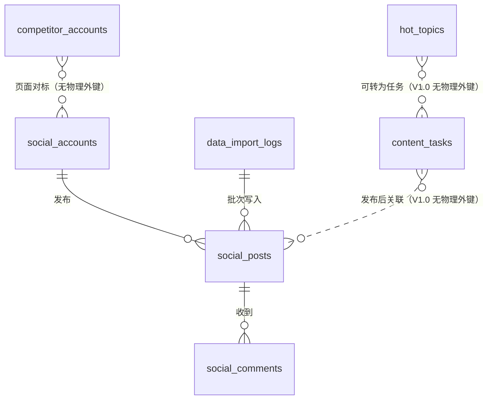

# 独山子大峡谷 AI 营销中台——新媒体运营数据库 V1.0

> 版本：V1.0
>
> 编制日期：2026-08-07
>
> 数据库：PostgreSQL 14+
>
> 范围：新媒体运营中心基础数据层，不包含自动采集功能

## 1. 交付内容

本版本依据 [`social-media-center-v1-architecture.md`](social-media-center-v1-architecture.md) 创建六张基础业务表，用于抖音、快手和微博的账号、作品、评论、热点、竞品和内容任务管理。第四阶段通过增量迁移新增 `data_import_logs`，不改写已经执行的基础迁移。

| 文件 | 用途 |
|---|---|
| `database/migrations/001_create_social_media_v1.sql` | 创建六张表、约束、索引和更新时间触发器 |
| `database/migrations/002_create_data_import_logs.sql` | 新增导入记录表和作品导入批次关联 |
| `database/seeds/001_social_media_v1_test_data.sql` | 幂等写入两个模拟账号和三条模拟作品 |

本迁移只创建 `social_*`、`hot_topics`、`competitor_accounts`、`content_tasks` 和专用触发器函数，不查询、不修改、不删除 OTA 销售驾驶舱或 OTA 舆情模块的任何表。

## 2. 设计约定

- 主键统一使用 UUID，由 `gen_random_uuid()` 生成。
- 时间字段使用 `TIMESTAMPTZ`，避免跨时区采集和展示产生歧义。
- 计数使用 `BIGINT`，并通过检查约束禁止负值；`fans_growth` 允许负值以表达掉粉。
- `hashtags` 和 `ai_analysis` 使用 JSONB，兼顾前端展示与后续分析结构扩展。
- 外键采用 `ON DELETE RESTRICT` 或 `CASCADE` 明确生命周期，不进行隐式跨模块操作。
- 测试数据使用 `example.invalid` 地址，明确表示非真实平台链接。

### 2.1 平台值

数据库使用稳定英文编码，页面显示中文名称：

| 数据库存储值 | 页面显示 |
|---|---|
| `douyin` | 抖音 |
| `kuaishou` | 快手 |
| `weibo` | 微博 |

## 3. 表用途与字段说明

### 3.1 `social_accounts`——账号管理表

用途：保存景区官方及矩阵新媒体账号的基础资料和最近一次汇总指标。

| 字段 | PostgreSQL 类型 | 必填/默认 | 说明 |
|---|---|---|---|
| id | UUID | 主键，自动生成 | 内部账号唯一标识 |
| platform | VARCHAR(32) | 必填 | 平台编码，限制为四个支持平台 |
| account_name | VARCHAR(255) | 必填 | 账号展示名称 |
| account_id | VARCHAR(128) | 必填 | 平台侧账号标识，按字符串保存以避免数字精度问题 |
| account_url | TEXT | 可空 | 账号主页地址 |
| followers_count | BIGINT | 默认 0 | 粉丝数，不得为负 |
| following_count | BIGINT | 默认 0 | 关注数，不得为负 |
| likes_count | BIGINT | 默认 0 | 累计获赞数，不得为负 |
| status | VARCHAR(32) | 默认 `active` | `active`、`inactive`、`archived` |
| created_at | TIMESTAMPTZ | 自动生成 | 创建时间 |
| updated_at | TIMESTAMPTZ | 自动维护 | 最近更新时间 |

唯一约束：`(platform, account_id)`；主要索引：`(platform, status)`。

### 3.2 `social_posts`——作品数据表

用途：保存账号发布的作品及当前表现数据，为内容分析和测试页面提供数据源。

| 字段 | PostgreSQL 类型 | 必填/默认 | 说明 |
|---|---|---|---|
| id | UUID | 主键，自动生成 | 内部作品唯一标识 |
| account_id | UUID | 必填，外键 | 关联 `social_accounts.id` |
| platform | VARCHAR(32) | 必填 | 作品所在平台 |
| title | VARCHAR(500) | 必填 | 作品标题 |
| content_type | VARCHAR(32) | 必填 | `video`、`image_text`、`text`、`live`、`article` |
| publish_time | TIMESTAMPTZ | 必填 | 平台发布时间 |
| video_url | TEXT | 可空 | 视频或作品地址 |
| cover_url | TEXT | 可空 | 封面地址 |
| views | BIGINT | 默认 0 | 播放或阅读量 |
| likes | BIGINT | 默认 0 | 点赞量 |
| comments | BIGINT | 默认 0 | 评论量 |
| favorites | BIGINT | 默认 0 | 收藏量 |
| shares | BIGINT | 默认 0 | 分享或转发量 |
| fans_growth | BIGINT | 默认 0 | 作品带来的净增粉，可为负数 |
| hashtags | JSONB | 默认空数组 | 话题标签字符串数组 |
| duration | INTEGER | 可空 | 视频时长，单位为秒 |
| ai_analysis | JSONB | 可空 | AI 分析结果对象；当前也可由人工写入测试结果 |
| created_at | TIMESTAMPTZ | 自动生成 | 创建时间 |
| updated_at | TIMESTAMPTZ | 自动维护 | 最近更新时间 |

外键：`account_id → social_accounts.id`，删除账号时限制删除；唯一约束：`(account_id, title, publish_time)`，用于 V1.0 幂等导入和测试数据重复执行。

### 3.3 `social_comments`——评论表

用途：保存作品评论、情感判断、关键词、用户需求和 AI 回复草案。

| 字段 | PostgreSQL 类型 | 必填/默认 | 说明 |
|---|---|---|---|
| id | UUID | 主键，自动生成 | 内部评论唯一标识 |
| post_id | UUID | 必填，外键 | 关联 `social_posts.id` |
| platform | VARCHAR(32) | 必填 | 评论来源平台 |
| username | VARCHAR(255) | 必填 | 评论用户名；生产数据建议入库前脱敏 |
| comment_text | TEXT | 必填 | 评论正文 |
| comment_time | TIMESTAMPTZ | 必填 | 评论发布时间 |
| likes | BIGINT | 默认 0 | 评论点赞数 |
| sentiment | VARCHAR(16) | 默认 `unknown` | `positive`、`neutral`、`negative`、`unknown` |
| keyword | VARCHAR(255) | 可空 | 主要关键词 |
| user_need | TEXT | 可空 | 识别出的咨询、投诉、攻略或购票需求 |
| ai_reply | TEXT | 可空 | AI 回复草案，必须人工审核后使用 |
| created_at | TIMESTAMPTZ | 自动生成 | 入库时间 |

外键：`post_id → social_posts.id`；删除作品时级联删除其评论。生产环境应限制评论原文和用户名的导出权限。

### 3.4 `hot_topics`——热点表

用途：保存各平台热点、热度变化、业务相关度及 AI 选题建议。

| 字段 | PostgreSQL 类型 | 必填/默认 | 说明 |
|---|---|---|---|
| id | UUID | 主键，自动生成 | 内部热点观察唯一标识 |
| platform | VARCHAR(32) | 必填 | 热点来源平台 |
| topic_name | VARCHAR(500) | 必填 | 热点名称 |
| keyword | VARCHAR(255) | 必填 | 用于景区关联匹配和选题生成的核心关键词 |
| heat_value | NUMERIC(20,2) | 默认 0 | 平台原始或标准化热度值，不得为负 |
| trend | VARCHAR(16) | 默认 `new` | `rising`、`stable`、`falling`、`new` |
| category | VARCHAR(128) | 可空 | 旅游、地域、活动、天气等分类 |
| related_degree | NUMERIC(5,4) | 可空 | 与景区的相关度，范围 0–1 |
| ai_suggestion | TEXT | 可空 | AI 生成的选题建议与风险提示 |
| status | VARCHAR(16) | 默认 `active` | `active`、`paused`、`archived`，表示运营监测状态 |
| collect_time | TIMESTAMPTZ | 自动生成 | 观察或导入时间 |
| created_at | TIMESTAMPTZ | 自动生成 | 热点记录创建时间 |

唯一约束：`(platform, topic_name, collect_time)`，允许同一热点形成时间序列。

热点监测中心 V1.0 通过 `database/migrations/003_enhance_hot_topics.sql` 增量增加上述字段和索引，不删除原字段；`collect_time` 继续表示最近观察/编辑时间，`created_at` 固定表示记录创建时间。

### 3.5 `competitor_accounts`——竞品账号表

用途：保存同行景区、区域文旅和标杆账号的对标基础资料。

| 字段 | PostgreSQL 类型 | 必填/默认 | 说明 |
|---|---|---|---|
| id | UUID | 主键，自动生成 | 内部竞品唯一标识 |
| platform | VARCHAR(32) | 必填 | 竞品所在平台 |
| account_name | VARCHAR(255) | 必填 | 竞品账号名称 |
| account_url | TEXT | 必填 | 竞品主页地址 |
| followers | BIGINT | 默认 0 | 最近一次记录的粉丝数 |
| industry | VARCHAR(128) | 可空 | 景区、区域文旅、旅行服务等行业分类 |
| created_at | TIMESTAMPTZ | 自动生成 | 创建时间 |

唯一约束：`(platform, account_url)`；V1.0 与官方账号表保持独立，避免错误外键关系。

### 3.6 `content_tasks`——内容任务表

用途：管理内容策划、制作、审核、排期、发布和复盘任务。

| 字段 | PostgreSQL 类型 | 必填/默认 | 说明 |
|---|---|---|---|
| id | UUID | 主键，自动生成 | 内部任务唯一标识 |
| task_date | DATE | 必填 | 任务日期 |
| platform | VARCHAR(32) | 必填 | 目标平台 |
| task_title | VARCHAR(500) | 必填 | 任务标题 |
| content_type | VARCHAR(32) | 必填 | 内容类型，与作品表口径一致 |
| responsible_person | VARCHAR(128) | 可空 | 负责人姓名或现有用户系统 ID |
| status | VARCHAR(32) | 默认 `idea` | `idea`、`approved`、`in_production`、`review`、`scheduled`、`published`、`blocked`、`done`、`cancelled` |
| review_result | TEXT | 可空 | 审核结论或退回原因 |
| created_at | TIMESTAMPTZ | 自动生成 | 创建时间 |

主要索引：`(task_date, status)`、`responsible_person`。V1.0 不执行自动发布。

### 3.7 `data_import_logs`——导入记录表

用途：持久记录 Excel 和图片导入批次，支持错误追踪、重新导入和按批次回滚。

| 字段 | PostgreSQL 类型 | 必填/默认 | 说明 |
|---|---|---|---|
| id | UUID | 主键，自动生成 | 导入批次唯一标识 |
| platform | VARCHAR(32) | 必填 | 数据所属平台 |
| file_name | VARCHAR(255) | 必填 | 原始文件名称 |
| import_type | VARCHAR(16) | 必填 | `excel` 或 `image` |
| status | VARCHAR(32) | 默认 `pending` | `pending`、`completed`、`failed`、`deleted` |
| success_count | INTEGER | 默认 0 | 成功写入或确认数量 |
| error_count | INTEGER | 默认 0 | 校验或写入错误数量 |
| created_at | TIMESTAMPTZ | 自动生成 | 导入记录创建时间 |

`social_posts.import_log_id` 可空外键关联该表。删除错误批次的数据时按该字段删除作品，但导入日志本身保留并标记为 `deleted`。

## 4. 表之间关系



V1.0 只有两条物理外键链：

1. `social_posts.account_id → social_accounts.id`：一个账号可以发布多条作品。
2. `social_comments.post_id → social_posts.id`：一条作品可以包含多条评论。

热点到任务、任务到作品、竞品到官方账号目前是业务层逻辑关系。待页面流程稳定后再通过增量迁移增加可空外键，避免首期把未确定的工作流固化到数据库。

## 5. 后续自动采集预留字段说明

V1.0 不开发或运行自动采集。当前字段中已有以下预留能力：

| 当前字段 | 预留用途 |
|---|---|
| `social_accounts.account_id` | 保存平台侧稳定账号 ID，未来 API 或浏览器采集可据此幂等匹配 |
| 各表 `platform` | 路由到对应平台 Adapter，并统一平台筛选 |
| `social_posts.publish_time` | 与平台作品发布时间对齐，辅助增量同步 |
| `hot_topics.collect_time` | 保存每次热点观察时间，支持未来趋势序列 |
| `hot_topics.keyword` | 为平台 API 返回的关键词、景区关联评分和后续语义检索提供统一入口 |
| `hot_topics.status` | 区分正在跟进、暂停和已归档热点，自动采集不会覆盖人工运营状态 |
| `social_posts.hashtags` | 接收平台返回的多标签数组 |
| `social_posts.ai_analysis` | 保存结构化分析结果，不保存凭据或浏览器会话 |
| `social_comments.ai_reply` | 保存待人工审批的回复草案，不表示已自动回复 |

V2.0 自动采集前建议通过新迁移增加以下可空字段，不应提前写入模拟自动采集逻辑：

| 建议字段 | 适用表 | 用途 |
|---|---|---|
| `platform_record_id` | 作品、评论、热点 | 平台侧记录 ID，用于可靠去重 |
| `source_type` | 账号、作品、评论、热点、竞品 | `manual`、`file`、`api`、`browser` |
| `source_ref` | 账号、作品、评论、热点、竞品 | 导入批次或采集任务 ID |
| `collected_at` | 账号、作品、评论、热点、竞品 | 数据实际采集时间，与平台发布时间区分 |
| `raw_data` | 账号、作品、评论、热点 | 保留受控的原始 JSON 快照以便追溯 |
| `last_synced_at` | 账号、竞品 | 最近成功同步时间 |
| `sync_status` | 账号、竞品 | 正常、授权过期、失败、暂停 |

平台令牌、Cookie、验证码和密码不属于预留业务字段，未来必须存入密钥管理系统，禁止进入数据库迁移、测试数据、Git 或日志。

## 6. 测试数据

种子脚本包含：

| 类型 | 平台 | 名称 |
|---|---|---|
| 账号 | 抖音 | 独山子大峡谷景区抖音 |
| 账号 | 微博 | 独山子大峡谷景区微博 |
| 作品 | 抖音 | 峡谷日落 |
| 作品 | 抖音 | 玻璃桥挑战 |
| 作品 | 微博 | 游客第一视角 |

所有链接均为 `example.invalid` 模拟地址，AI 分析标记 `sample: true`，不得作为真实运营数据发布或汇报。

## 7. 执行与检查

在已配置的 PostgreSQL 测试数据库中执行：

```bash
psql "$DATABASE_URL" -v ON_ERROR_STOP=1 \
  -f database/migrations/001_create_social_media_v1.sql

psql "$DATABASE_URL" -v ON_ERROR_STOP=1 \
  -f database/migrations/002_create_data_import_logs.sql

psql "$DATABASE_URL" -v ON_ERROR_STOP=1 \
  -f database/migrations/003_enhance_hot_topics.sql

psql "$DATABASE_URL" -v ON_ERROR_STOP=1 \
  -f database/seeds/001_social_media_v1_test_data.sql
```

检查六张表是否存在：

```sql
SELECT table_name
FROM information_schema.tables
WHERE table_schema = 'public'
  AND table_name IN (
    'social_accounts', 'social_posts', 'social_comments',
    'hot_topics', 'competitor_accounts', 'content_tasks'
  )
ORDER BY table_name;
```

检查模拟数据：

```sql
SELECT platform, account_name, followers_count
FROM social_accounts
ORDER BY platform;

SELECT a.account_name, p.platform, p.title, p.views
FROM social_posts AS p
JOIN social_accounts AS a ON a.id = p.account_id
ORDER BY p.publish_time;
```

## 8. 边界与升级规则

- 本版本没有定时任务、浏览器脚本、平台 API 客户端或自动发布逻辑。
- 不使用 OTA 数据库表作为外键，也不要求修改 OTA 模块的迁移历史。
- 后续字段变更必须新增迁移文件，不直接修改已经执行的 `001` 迁移。
- 在真实中台仓库落地前，应确认 Schema 命名、迁移工具、数据库用户权限和备份策略。
- 生产环境执行迁移前，必须先在隔离测试库验证，并完成两个 OTA 模块的回归检查。
