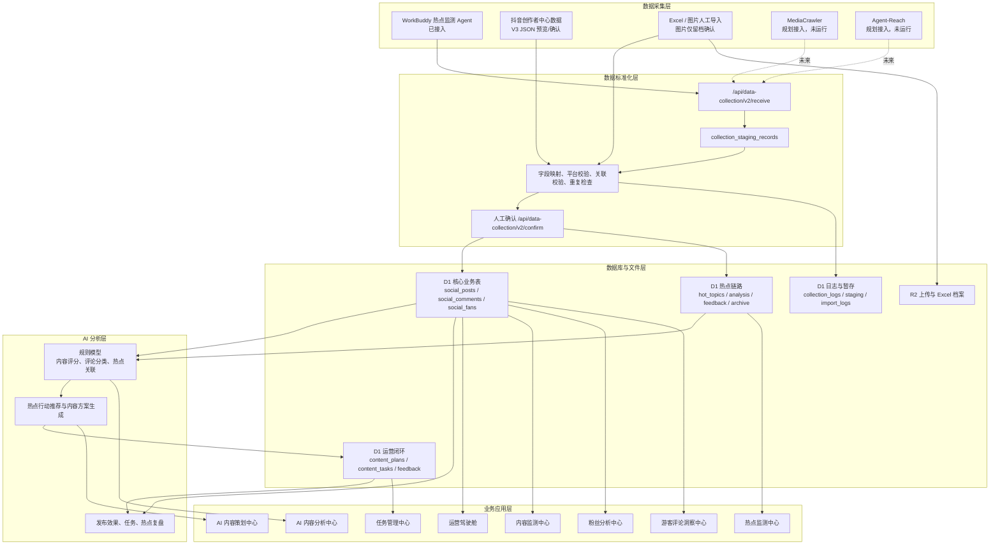

# 独山子大峡谷 AI 新媒体运营中心系统架构

> 文档版本：V1.0
> 核对基线：2026-08-18，`main` 分支
> 事实来源：`apps/social-media-center` 下的页面、API、`db/schema.ts`、Worker 与部署配置。

## 1. 系统定位

新媒体运营中心是“独山子大峡谷 AI 营销中台”的新媒体子系统，负责把外部热点、平台作品、评论和粉丝数据转化为可执行的内容方案、生产任务和复盘结论。当前代码仓库独立于 OTA 销售系统，本文不包含 OTA 销售驾驶舱或 OTA 舆情模块。

当前正式数据闭环优先支持抖音；快手、微博已经进入平台枚举、筛选和统一接收协议，但真实数据覆盖仍需补齐。视频号已不在当前数据库平台约束与页面范围中。

## 2. 技术架构

| 层级 | 当前实现 | 职责 |
|---|---|---|
| 前端 | Next.js 16、React 19、TypeScript、Vinext | 页面路由、响应式界面、预览与人工确认交互 |
| API | Next.js App Router Route Handlers | 查询、标准化、校验、确认入库、规则分析与报表导出 |
| 数据访问 | Cloudflare D1、Drizzle ORM、原生 D1 SQL | 结构化业务数据、关联查询与事务批处理 |
| 文件存储 | Cloudflare R2 `UPLOADS` | Excel/图片导入留档、热点档案 Excel 文件 |
| 运行环境 | Cloudflare Worker + Sites 构建插件 | Web 请求、图片优化、定时档案与复盘刷新 |
| 自动任务 | Worker Cron `30 0 * * *` | 北京时间约 08:30 生成热点档案、刷新内容策划反馈、同步任务与作品 |

## 3. 分层架构

## 4. 数据采集层

### 4.1 已运行链路

- **WorkBuddy**：通过统一 V2 接收接口或兼容的热点导入接口接收 JSON/Excel，经过预览和人工确认后写入 `hot_topics`；原始兼容数据也可进入 `HOT_TOPIC_DATA`。
- **抖音创作者中心**：V3 接口接收已采集的粉丝、增长、作品、观众和评论 JSON，先生成无落库预览，只有 `confirmed=true` 才批量写入业务表。
- **人工导入**：Excel 可映射作品字段并确认写入；图片上传只保存记录和文件，复杂 OCR 未实现。

### 4.2 预留链路

- **MediaCrawler**：已完成技术评估和接口规划，主系统没有安装其依赖，也没有运行其采集任务。
- **Agent-Reach**：已完成全网趋势/新闻补充定位，尚未接入运行时数据源。
- 统一接收接口本身只负责接收和标准化，不会启动浏览器或第三方采集器。

## 5. 数据标准化层

统一接口把来源数据分为三类：

| 类型 | 标准表 | 关键约束 |
|---|---|---|
| `hot_topic` | `hot_topics` | 同一批次单平台；同日重复必须选择覆盖或跳过 |
| `content` | `social_posts` | 必须关联启用账号；账号标题组合去重 |
| `comment` | `social_comments` | 必须关联已存在且平台一致的作品；内容级重复跳过 |

接收后先写 `collection_logs` 与 `collection_staging_records`，不会直接写业务表。只要批次存在无效记录，确认接口就拒绝整批写入，避免部分数据污染。

## 6. 数据库层

数据库以 D1 为主，按四条业务链组织：

1. 账号与内容：`social_accounts` → `social_posts` → `social_comments` / `content_audience_analysis`。
2. 粉丝：`social_accounts` → `social_fans` / `fan_growth_records`。
3. 热点：`hot_topics` → `hot_topic_analysis` → `hot_topic_feedback` → `hot_topic_archive`。
4. 策划与任务：`hot_topics` → `content_plans` → `content_tasks` → `content_plan_feedback`，并关联 `social_posts`。

完整字段和关系见 [数据库设计](database-design.md)。

## 7. AI 分析层

当前“AI”能力以确定性规则模型为主，而非已接入的大模型服务：

- 抖音内容效果评价 V1.0：读取作品主表、最新快照、真实趋势、流量来源、DOU+、作品级观众、热词和最新快照评论，生成传播 30 / 互动 25 / 用户吸引 25 / 内容效率 20 的动态账号基准评分；缺失值重加权，DOU+ 不进入自然爆款。
- 评论洞察：用关键词规则识别情绪、游客需求和运营建议，可将分析结果回写评论表。
- 热点分析：结合热度、旅游/新疆/景区关键词和历史内容，生成关联度、推荐等级、标题和拍摄方向。
- 内容策划：仅对抖音 A 级热点生成标题、脚本、分镜、标签、发布时间和目标值。
- 效果复盘：读取关联作品指标，计算热点、内容方案与任务是否达标。

大模型 API 仍属于后续增强项；文档中所有“AI 生成”均应按当前规则引擎理解，除非代码另行接入模型服务。

## 8. 业务应用层

| 模块 | 页面 | 核心数据流 |
|---|---|---|
| 运营驾驶舱 | `/` | 账号、作品、热点和任务汇总为周期 KPI 与排行 |
| 内容监测中心 | `/insights/content` | 作品主表 + 最新快照 + 趋势/流量/DOU+/观众/热词/评论 + `hot_topic_feedback` 生成内容效果排行、证据诊断、爆款/低效分析 |
| 粉丝分析中心 | `/insights/fans` | `social_fans` + `fan_growth_records` + `social_posts.fans_growth` 生成趋势、画像与周报 |
| 数据采集中心 | `/collector`、`/imports` | 自动采集数据预览确认、Excel/图片导入、采集日志 |
| 热点监测中心 | `/hot-topics` | `hot_topics` + `hot_topic_analysis` + `hot_topic_feedback` 展示推荐、选题与复盘 |
| 热点档案库 | `/hot-topic-archive` | 每日快照查询、筛选和 Excel 下载 |
| AI 内容分析中心 | `/ai-analysis` | 规则引擎对作品和平台生成日报/周报 |
| AI 内容策划中心 | `/content-planning` | A 级热点 → 内容方案 → 任务 → 作品 → 7 日复盘 |
| 游客评论洞察中心 | `/comment-insights` | 评论情绪、关键词、游客需求与拍摄建议 |
| 任务管理中心 | `/tasks` | 八阶段 Kanban 拖拽、来源记录、作品自动关联、周报 |
| 营销运营中心 | `/marketing-operations` | 汇总热点、待办、任务、发布计划和目标，不新增业务表 |

## 9. 端到端数据流

1. 外部工具或人工流程形成源数据。
2. 数据进入专用预览接口或统一 V2 接收接口。
3. 服务端标准化、校验并写暂存记录和采集日志。
4. 人工确认后批量写入核心表。
5. 监测页面按平台和日期范围读取真实数据库数据。
6. 规则模型生成热点、内容、评论和粉丝建议。
7. A 级热点生成内容方案和任务。
8. 任务发布后关联 `social_posts`，定时任务刷新效果反馈。
9. 热点档案沉淀每日原始热点、分析、推荐和复盘结果。

## 10. 架构边界与已知差异

- 当前数据库平台约束为抖音、快手、微博；视频号不是现有能力。
- 页面能够切换快手和微博，但真实采集闭环当前以抖音为主。
- `HOT_TOPIC_DATA` 是早期/兼容的外部 Agent 热点表；当前业务主链使用标准化后的 `hot_topics`。
- `MediaCrawler`、`Agent-Reach` 目录存在于本地工作区不等于已接入主系统；它们没有纳入本次文档提交。
- 采集、分析和报表的准确性取决于数据完整率、平台口径和采集时间，不能把规则结论视为平台官方归因。
