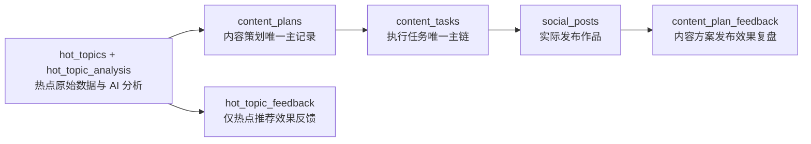

# 新媒体运营中心 V2.0 重组前稳定基线

> 基线名称：`social-v1.0-stable`
> 目的：锁定 V2.0 信息架构重组前可恢复、可验证的生产状态。
> 原则：后续阶段只新增导航、页面容器与聚合查询；冻结区只能复用和重新挂接入口。

## 1. 代码与部署基线

基线维护开始前：

| 项目 | Commit |
|---|---|
| 本地 `main` | `a95140a8909603a3dd37b5c7217519c98689f12c` |
| `origin/main` | `27c6d630298f8c41c5fa1f68ca7a70e7a3ad3c25` |
| 本地领先/落后 | `1 / 0` |
| 已验证待同步提交 | `a95140a feat(content): 接入WorkBuddy抖音每日监测V2.2并支持作品跨日快照` |

待同步提交只涉及 `apps/social-media-center`，不包含 OTA、`Agent-Reach/` 或 `MediaCrawler/`。最终生产 Commit 以 `social-v1.0-stable` 所指向的 Commit 为准。

## 2. 生产数据库备份

迁移前已完成生产 D1 的完整逻辑备份，并逐表重新读取校验：

| 项目 | 结果 |
|---|---|
| 开始时间 | 2026-08-22 15:26:48（北京时间） |
| 完成时间 | 2026-08-22 15:42:11（北京时间） |
| 方式 | D1 全部用户表、Schema、索引和数据按表分页写入生产 R2 |
| Manifest | `database-backups/social-v1.0-stable-pre-v2/2026-08-22T07-26-48.828Z/manifest.json` |
| Manifest SHA-256 | `2650bc3735815366f8a6aca1afe7118b5a9d08cd33894bab8baa334e80ea0cb9` |
| Schema 对象 | 132 |
| 表 | 33（含 `__appgarden_migrations`，业务表 32） |
| 逻辑备份大小 | 53,870,921 bytes |
| 校验 | 每个分页对象 checksum、逐表数量、Manifest checksum 全部通过 |

恢复时应创建新的空 D1，按 Manifest 中的 Schema 顺序创建表与索引，再按表导入分页数据，校验行数、checksum 和外键，最后切换 `DB` 绑定。禁止直接在原生产库上先清空再恢复。恢复属于生产切换操作，必须单独确认。

## 3. Schema 对账与兼容策略

迁移前本地和生产均为 32 张业务表，但集合不同：

- 仅本地：`social_post_evaluations`，以及评价索引、每日快照防重索引、真实趋势时间点防重索引。
- 仅生产：`data_maintenance_runs`，其中已有 1 条真实维护记录。
- 仅本地字段：`social_post_snapshots.snapshot_date`、`collection_batch`。
- 代码声明问题：评论点赞可用性字段已归位到 `social_comments`；不再错误声明在 `social_posts`。

统一策略：

1. `social_post_evaluations` 是 V2.2 内容效果评价历史的真实使用表，正式纳入 `db/schema.ts`、`db/bootstrap.ts` 和迁移。
2. `data_maintenance_runs` 保留生产历史数据，并正式补入 Schema 与兼容建表定义。
3. 生产迁移只新增表、列和索引，不删除、清空或重建历史业务表。
4. 旧建库方式造成的 CHECK 约束写法、主键 `NOT NULL` 表述和普通索引 ASC/DESC 文本差异记录为“历史 DDL 表达差异”。它们不通过重建表强行抹平；代码、迁移与两套 D1 的业务表、字段、唯一性和业务索引达到逻辑一致。

目标业务表数：本地 D1 33、生产 D1 33；生产内部迁移表不计入业务表数。

## 4. 冻结区

以下能力进入冻结区，V2.0 页面重组不得重新实现或改变规则：

- WorkBuddy 抖音作品每日监测 V2.2、固定目录、每日 JSON 与命名规范。
- 文件发现、checksum 防重复、预览、确认、批次日志。
- `social_posts` 作品主表、作品每日快照、平台真实趋势序列。
- 流量分析、流量来源、DOU+ 付费流量、作品级观众画像。
- 评论热词、真实评论、评论回复和数据可用状态。
- 抖音内容效果评价模型与评价历史。
- 粉丝快照、增长、画像和采集批次模型。
- 热点采集、热点分析、热点档案和 `hot_topic_feedback`。
- `content_plans`、`content_plan_feedback`、`content_tasks` 及现有任务关联。
- 所有现有真实历史数据。

允许的改造方式只有：复用、聚合、移动入口、增加页面容器和参数化挂接。

## 5. V2.0 唯一业务主链

- 平台运营中心的“AI 选题推荐”只传递 `{ platform, hot_topic_id }` 到 AI 内容策划中心。
- 平台页面不得另建完整方案、任务或复盘数据链。
- `hot_topic_feedback` 不承担内容方案主记录职责。

## 6. 跨平台指标口径

统一展示层字段为：`followers`、`post_count`、`views_or_exposure`、`likes`、`comments`、`favorites`、`shares`。

| 平台 | `views_or_exposure` 原始口径 |
|---|---|
| 抖音 | 播放 |
| 快手 | 播放 |
| 微博 | 曝光/阅读 |
| 视频号 | 播放 |

统一字段只用于管理层展示，不改变原始平台指标名称和业务含义。总览必须显示口径说明。DOU+ 付费流量不计入自然传播占比；无法准确拆分时降低自然表现置信度，不做“总播放减投流”的人工推算。

## 7. 健康验证标准

- 同一 WorkBuddy 作品文件重复处理返回 `already_processed` 或等价结果。
- 同一作品跨日采集只增加 snapshot，不重复创建 `social_posts`。
- 历史 snapshot、metric series 和 evaluation 可查询。
- 热点自动接力使用北京时间判断文件日期和采集日期。
- 热点文件重复扫描不得重复写入 `hot_topics`。
- LaunchAgent 已加载，最近一次退出码为 0；单次任务正常结束不等同于后台异常。
- 全量测试、Lint、生产构建和正式 API 冒烟检查通过。

## 8. V2.0 页面阶段约束

进入“阶段1：导航骨架与页面容器”后仍禁止移动底层业务代码、删除旧 URL、删除兼容 API、修改采集规则或清理历史数据。任何 Schema、采集或评价规则变更必须退出冻结区，另立迁移任务并重新备份。
