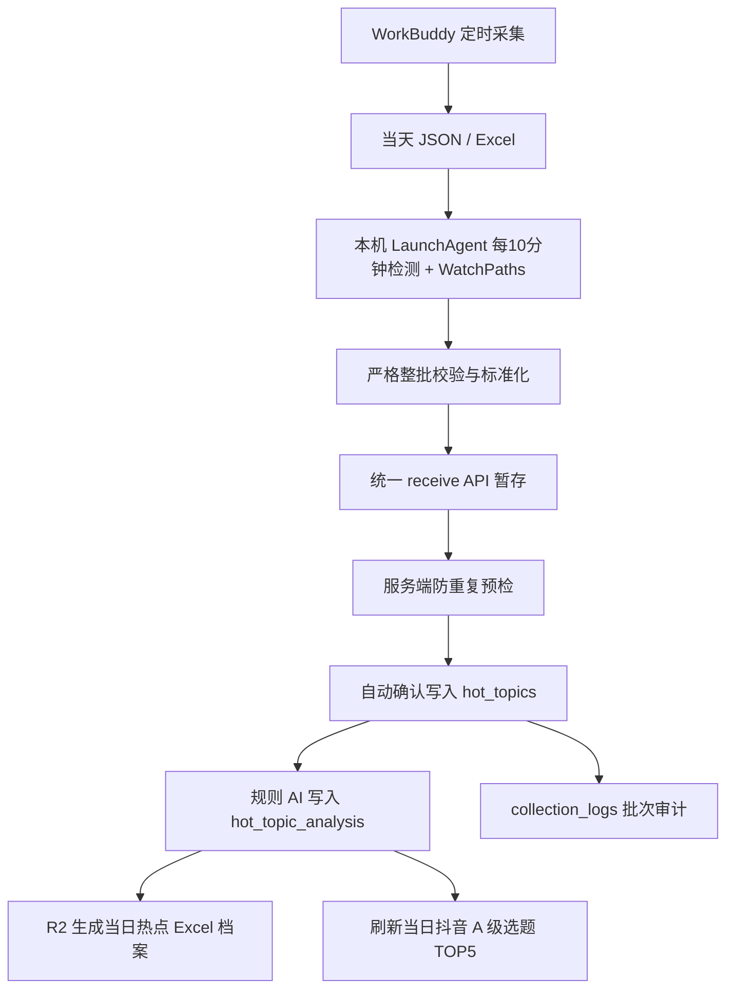

# WorkBuddy 热点自动接力 V1.0

## 定位

WorkBuddy 继续负责按既有计划生成热点文件，新媒体运营中心只负责“检测、校验、标准化、入库、分析、归档和业务联动”。自动接力不访问平台、不修改 WorkBuddy 调度，也不读取 OTA 系统。

Cloudflare Sites 无法直接访问运营电脑的桌面目录，因此接力由两部分组成：

1. 本机轻量接力器监测 `~/Desktop/景区AI营销数据/hot_topics/`，读取当天的 `hot_topic_YYYYMMDD.json`、`.xlsx` 或 `.xls`。
2. 云端接口复用数据采集中心、D1、规则分析、R2 档案和 AI 内容策划逻辑，完成正式处理。



## 文件规则与质量门禁

- 文件名必须为 `hot_topic_YYYYMMDD.json|xlsx|xls`。
- JSON 顶层可为数组，或包含 `records`、`data`、`topics` 数组；Excel 使用首个工作表。
- 单文件最多 500 条。
- 每条必须包含可识别的平台、非空热点名称、正整数排名、有效采集时间和可识别榜单类型。
- 采集时间的北京时间日期必须与文件名日期一致。
- 任一关键字段失败时，整批停止，不确认业务数据、不执行 AI、不生成成功档案。

去重键固定为：

`文件日期 + 平台 + 榜单类型 + 热点名称 + 排名`

自动接力在正式确认前对暂存数据和 `hot_topics` 做一次完整预检。发现文件内重复或库内已有相同键时整批停止，避免部分写入。

## 自动处理接口

`POST /api/workbuddy-relay` 仅供本机接力器使用，并沿用 `x-collector-key` 鉴权：

- `action=start`：登记自动接力批次，同一文件已有 `processing` 或 `success` 时不重复启动。
- `action=preflight`：核验所有接收批次、暂存数量和精确去重键。
- `action=finalize`：确认入库完成后执行规则 AI、生成档案并计算当日抖音 A 级 TOP5。
- `action=fail`：记录文件、失败环节、失败原因和数量，不删除历史数据。

`GET /api/workbuddy-relay` 返回今日状态和最后一次成功状态，供数据采集中心展示。

## 本机运行与安装

仅检查最新真实文件，不写数据库：

```bash
cd apps/social-media-center
pnpm automation:workbuddy -- --file=hot_topic_20260816.json --dry-run
```

手动执行指定文件的完整接力：

```bash
pnpm automation:workbuddy -- --file=hot_topic_20260816.json
```

安装 macOS LaunchAgent 前，在当前终端设置部署地址和必要凭据。真实值不得写入 Git：

```bash
export WORKBUDDY_API_BASE_URL="https://your-social-center.chatgpt.site"
export WORKBUDDY_AGENT_KEY="..."
export WORKBUDDY_SITES_BEARER_TOKEN="..."
pnpm automation:workbuddy:install
```

安装器会创建权限为 `0600` 的 `~/Library/LaunchAgents/com.dushanzi.social-center.workbuddy-hot-topic-relay.plist`。服务监听输出目录并每 600 秒兜底检查一次，只处理北京时间当天文件；历史真实文件测试必须显式传入 `--file`。

由于 WorkBuddy 输出目录位于 macOS 受保护的 `Desktop`，首次启用后台调度时还需要在“系统设置 → 隐私与安全性 → 完全磁盘访问权限”中允许安装器实际使用的 Node 可执行文件（当前安装路径可通过 `which node` 查看）。这是 macOS 的一次性系统授权，未授权时系统会阻止 LaunchAgent 读取热点文件；不要通过关闭系统安全机制绕过。

## 失败保护

- 文件不存在、为空或格式错误：记录 `detect` / `validate` 失败。
- 暂存或防重复失败：记录 `receive` / `confirm` 失败，不进入 AI 和归档。
- AI 分析失败：保留已经入库的原始热点，不创建成功档案，不以历史结果代替当天结果。
- 归档失败：状态保持失败，AI 内容策划不会标记为本批次成功刷新。
- 所有历史热点、昨日档案和上一日推荐均不删除；内容策划首页只查询北京时间当天热点，不回退旧数据冒充今日推荐。

## 运维检查

- 数据采集中心展示今日检测状态、入库数、AI 分析数、A级数、归档状态、文件名和最后成功时间。
- 本机日志位于 `~/Library/Logs/dushanzi-social-center/`。
- 云端批次记录使用 `collection_logs.entity_type=workbuddy_relay`；每个平台的标准化接收批次继续保留在 `collection_logs` 和 `collection_staging_records`。
- 档案对象名为 `YYYY-MM-DD_新媒体热点分析报告.xlsx`，存储于 R2 的 `hot-topic-archive/`。
